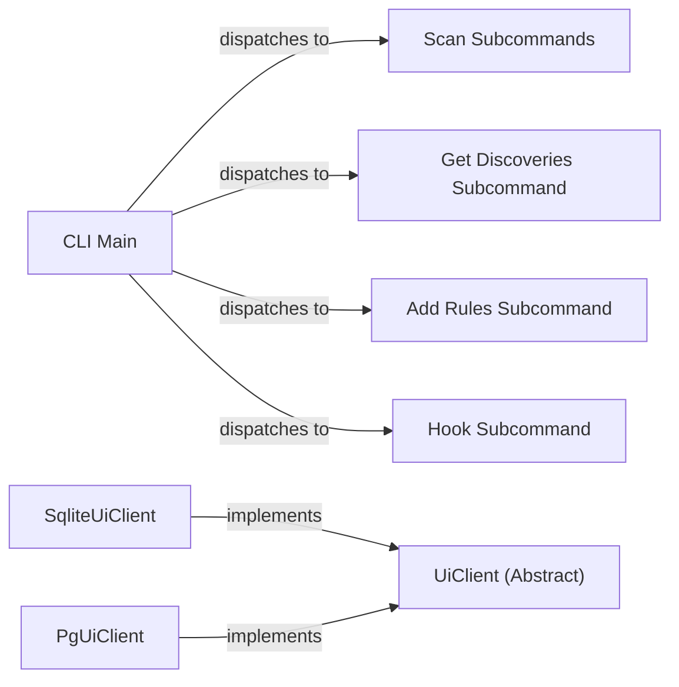

## Component Details

The User Interface component provides the entry point for users to interact with the Credential Digger tool. It encompasses both the command-line interface (CLI) and the UI backend, allowing users to initiate scans, manage rules, and view scan results. The CLI handles command-line arguments and triggers the appropriate scanning and reporting functionalities, while the UI backend provides a web-based interface for visualizing and managing scan data. The CLI uses `argparse` to parse command-line arguments and dispatches to the appropriate subcommands (scan, scan_path, etc.). The UI backend provides methods for retrieving files summary, checking repositories, and getting discoveries with rules. Subclasses implement the actual database interaction.

### CLI Main
The entry point for the command-line interface. It parses arguments using `argparse` and dispatches to specific subcommands based on user input.
- **Related Classes/Methods**: `credentialdigger.cli.cli`

### Scan Subcommands
A group of subcommands (scan, scan_path, scan_pr, scan_snapshot, scan_user, scan_wiki) responsible for initiating different types of scans. They orchestrate the scanning process and interact with the core scanning logic and the database.
- **Related Classes/Methods**: `credentialdigger.cli.scan`, `credentialdigger.cli.scan_path`, `credentialdigger.cli.scan_pr`, `credentialdigger.cli.scan_snapshot`, `credentialdigger.cli.scan_user`, `credentialdigger.cli.scan_wiki`

### Get Discoveries Subcommand
Handles the 'get_discoveries' subcommand, retrieving scan results (discoveries) from the database and displaying them to the user.
- **Related Classes/Methods**: `credentialdigger.cli.get_discoveries`

### Add Rules Subcommand
Handles the 'add_rules' subcommand, allowing users to add new rules for credential detection to the system. It interacts with the database to store these rules.
- **Related Classes/Methods**: `credentialdigger.cli.add_rules`

### Hook Subcommand
Handles the 'hook' subcommand, which is responsible for setting up and managing git hooks to automatically scan commits for credentials before they are pushed.
- **Related Classes/Methods**: `credentialdigger.cli.hook`

### UiClient (Abstract)
An abstract base class that defines the interface for UI clients. It specifies methods for interacting with the UI backend, such as retrieving file summaries, checking repositories, and getting discoveries with rules.
- **Related Classes/Methods**: `credentialdigger.ui.backend.client_ui.UiClient`

### SqliteUiClient
An implementation of the UiClient interface that uses SQLite as the backend database. It provides concrete methods for retrieving data from the SQLite database.
- **Related Classes/Methods**: `credentialdigger.ui.backend.client_ui_sqlite.SqliteUiClient`

### PgUiClient
An implementation of the UiClient interface that uses PostgreSQL as the backend database. It provides concrete methods for retrieving data from the PostgreSQL database.
- **Related Classes/Methods**: `credentialdigger.ui.backend.client_ui_postgres.PgUiClient`
