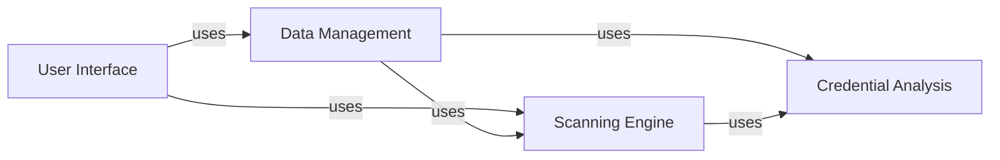

## Component Details

The Credential Digger project is designed to automatically scan codebases and other data sources for potential credentials, secrets, and other sensitive information. It provides a command-line interface (CLI) for initiating scans, managing rules, and accessing scan results. The core functionality involves scanning data sources using various scanners, analyzing the content for potential credentials using regular expressions and machine learning models, and storing the scan results in a database. The project supports both SQLite and PostgreSQL as data store options and offers a UI backend for visualizing and managing scan data.

### User Interface
The User Interface component provides the entry point for users to interact with the Credential Digger tool. It encompasses both the command-line interface (CLI) and the UI backend, allowing users to initiate scans, manage rules, and view scan results. The CLI handles command-line arguments and triggers the appropriate scanning and reporting functionalities, while the UI backend provides a web-based interface for visualizing and managing scan data.
- **Related Classes/Methods**: `credentialdigger.cli.cli`, `credentialdigger.cli.scan`, `credentialdigger.cli.scan_path`, `credentialdigger.cli.scan_pr`, `credentialdigger.cli.scan_snapshot`, `credentialdigger.cli.scan_user`, `credentialdigger.cli.scan_wiki`, `credentialdigger.cli.get_discoveries`, `credentialdigger.cli.add_rules`, `credentialdigger.cli.hook`, `credentialdigger.ui.backend.client_ui.UiClient`, `credentialdigger.ui.backend.client_ui_sqlite.SqliteUiClient`, `credentialdigger.ui.backend.client_ui_postgres.PgUiClient`

### Data Management
The Data Management component is responsible for handling all interactions with the data store, providing an abstraction layer for managing repositories, rules, and discoveries. It supports both SQLite and PostgreSQL databases, allowing users to choose the data store that best suits their needs. This component ensures a consistent API for data access, regardless of the underlying database implementation.
- **Related Classes/Methods**: `credentialdigger.client.Client`, `credentialdigger.client_sqlite.SqliteClient`, `credentialdigger.client_postgres.PgClient`

### Scanning Engine
The Scanning Engine component is the core of the Credential Digger tool, responsible for scanning various data sources for potential credentials. It provides a base scanner class that can be extended to support different data source types, such as Git repositories, files, and directories. The scanning engine utilizes regular expressions and machine learning models to identify potential secrets and sensitive information.
- **Related Classes/Methods**: `credentialdigger.scanners.base_scanner.BaseScanner`, `credentialdigger.scanners.git_scanner.GitScanner`, `credentialdigger.scanners.git_file_scanner.GitFileScanner`, `credentialdigger.scanners.git_pr_scanner.GitPRScanner`, `credentialdigger.scanners.file_scanner.FileScanner`

### Credential Analysis
The Credential Analysis component enhances the scanning process by incorporating machine learning models and snippet similarity analysis. It utilizes ML models for password and path analysis, improving the accuracy of credential detection. Additionally, it computes the similarity between code snippets to identify potential credential reuse, further strengthening the tool's ability to detect sensitive information.
- **Related Classes/Methods**: `credentialdigger.models.password_model.PasswordModel`, `credentialdigger.models.path_model.PathModel`, `credentialdigger.models.model_manager.ModelManager`, `credentialdigger.snippet_similarity`