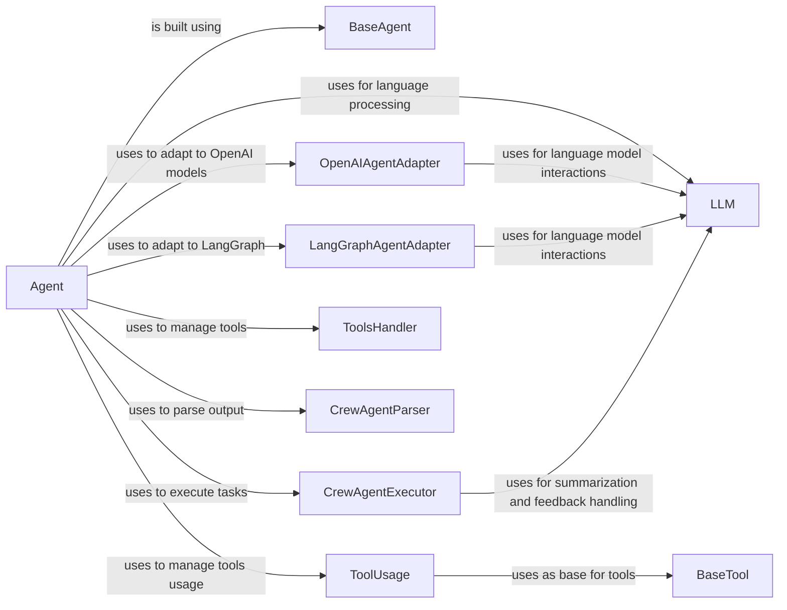

## Component Details

The AgentManager component orchestrates the creation, configuration, and execution of intelligent agents within the crewAI framework. It leverages various sub-components to define agent behavior, manage tool usage, interact with language models, and parse agent outputs. The central flow involves defining an agent with specific tools and a role, then executing tasks using a language model and parsing the results.

### Agent
The Agent class represents an individual agent within the crew. It is responsible for setting up the agent's executor, managing knowledge, and executing tasks. It orchestrates the agent's behavior, including tool usage and interaction with the LLM.
- **Related Classes/Methods**: `crewAI.src.crewai.agent.Agent`

### LLM
The LLM class represents the language model used by the agent. It handles preparing completion parameters, making calls to the language model, and handling streaming and non-streaming responses. It provides the interface for the agent to interact with the language model.
- **Related Classes/Methods**: `crewAI.src.crewai.llm.LLM`

### BaseAgent
The BaseAgent class provides a base for agent building, handling model configuration, tool validation, and attribute setting. It ensures that agents are properly configured and initialized before execution.
- **Related Classes/Methods**: `crewAI.src.crewai.agents.agent_builder.base_agent.BaseAgent`

### OpenAIAgentAdapter
The OpenAIAgentAdapter adapts the agent to work with OpenAI models. It configures tools, builds system prompts, executes tasks, and handles execution results. It bridges the gap between the agent and the OpenAI API.
- **Related Classes/Methods**: `crewAI.src.crewai.agents.agent_adapters.openai_agents.openai_adapter.OpenAIAgentAdapter`

### LangGraphAgentAdapter
The LangGraphAgentAdapter adapts the agent to work with LangGraph. It sets up the graph, builds system prompts, executes tasks, and configures tools. It enables the agent to leverage LangGraph's graph-based execution framework.
- **Related Classes/Methods**: `crewAI.src.crewai.agents.agent_adapters.langgraph.langgraph_adapter.LangGraphAgentAdapter`

### CrewAgentExecutor
The CrewAgentExecutor is responsible for executing the agent's tasks in a loop, handling agent actions, appending messages, and managing feedback. It drives the agent's task execution and manages the interaction loop.
- **Related Classes/Methods**: `crewAI.src.crewai.agents.crew_agent_executor.CrewAgentExecutor`

### ToolsHandler
The ToolsHandler manages the usage of tools by the agent, including tracking tool usage. It provides a centralized mechanism for managing and monitoring tool interactions.
- **Related Classes/Methods**: `crewAI.src.crewai.agents.tools_handler.ToolsHandler`

### CrewAgentParser
The CrewAgentParser is responsible for parsing the agent's output. It extracts relevant information from the agent's responses.
- **Related Classes/Methods**: `crewAI.src.crewai.agents.parser.CrewAgentParser`

### ToolUsage
The ToolUsage class handles the usage of tools, including parsing tool calling, using tools, formatting results, and validating tool input. It ensures that tools are used correctly and efficiently.
- **Related Classes/Methods**: `crewAI.src.crewai.tools.tool_usage.ToolUsage`

### BaseTool
The BaseTool class provides a base for creating tools. It handles model post-initialization, running the tool, and converting the tool to a structured tool. It defines the common interface for all tools used by the agents.
- **Related Classes/Methods**: `crewAI.src.crewai.tools.base_tool.BaseTool`
