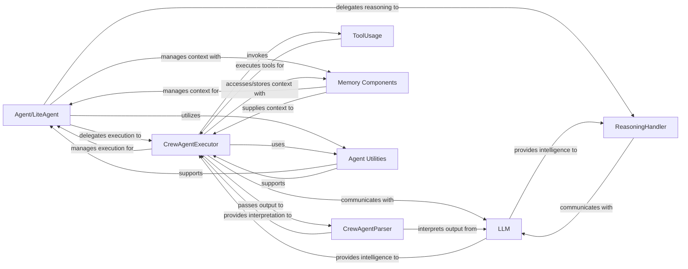

## Details

The Agent System subsystem encapsulates the intelligence, roles, and decision-making logic of individual AI agents within a crew. It is central to the AI Agent Orchestration Framework's agent-centric design.

### Agent/LiteAgent
Initializes and manages the agent's lifecycle, including setting up the executor, formatting messages, and initiating the core execution loop. It serves as the primary entry point for an agent's operations.

**Related Classes/Methods**:

- <a href="https://github.com/crewAIInc/crewAI/blob/main/src/crewai/lite_agent.py" target="_blank" rel="noopener noreferrer">`src.crewai.lite_agent.py`</a>

### ReasoningHandler
Guides the agent's thought process by creating and refining plans, constructing prompts, and parsing structured reasoning responses from the LLM. It is critical for the agent's intelligent decision-making.

**Related Classes/Methods**:

- <a href="https://github.com/crewAIInc/crewAI/blob/main/src/crewai/utilities/reasoning_handler.py" target="_blank" rel="noopener noreferrer">`src/crewai/utilities/reasoning_handler.py`</a>

### CrewAgentExecutor
Orchestrates the iterative execution flow of agent actions, managing the invocation loop, human feedback, and processing individual agent steps. It is the engine driving the agent's actions.

**Related Classes/Methods**:

- <a href="https://github.com/crewAIInc/crewAI/blob/main/src/crewai/agents/crew_agent_executor.py" target="_blank" rel="noopener noreferrer">`src/crewai/agents/crew_agent_executor.py`</a>

### CrewAgentParser
Interprets raw text output from the LLM, extracting structured AgentAction (tool calls) or AgentFinish (final answer) objects. This component is vital for the agent to understand and act upon the LLM's responses.

**Related Classes/Methods**:

- <a href="https://github.com/crewAIInc/crewAI/blob/main/src/crewai/agents/parser.py" target="_blank" rel="noopener noreferrer">`src/crewai/agents/parser.py`</a>

### LLM
Acts as a unified interface for various LLM providers, handling API calls, preparing completion parameters, and processing streaming/non-streaming responses, including tool calls. It is the core intelligence provider for the agent.

**Related Classes/Methods**:

- <a href="https://github.com/crewAIInc/crewAI/blob/main/src/crewai/llm.py" target="_blank" rel="noopener noreferrer">`src/crewai/llm.py`</a>

### ToolUsage
Facilitates the agent's use of external tools by parsing tool calling formats, selecting, executing, and managing errors or usage limits. This enables the agent to interact with the external environment.

**Related Classes/Methods**:

- <a href="https://github.com/crewAIInc/crewAI/blob/main/src/crewai/tools/tool_usage.py" target="_blank" rel="noopener noreferrer">`src/crewai/tools/tool_usage.py`</a>

### Memory Components
Manages different types of agent memory (e.g., short-term, long-term, external, contextual) by storing information and retrieving relevant context for tasks. It provides the agent with state and historical context.

**Related Classes/Methods**:

- <a href="https://github.com/crewAIInc/crewAI/blob/main/src/crewai/memory" target="_blank" rel="noopener noreferrer">`src/crewai/memory`</a>

### Agent Utilities
Provides common utility functions supporting agent operations, such as handling maximum iteration limits, processing LLM responses, and managing context length. These are supporting functions that ensure the smooth operation of the agent.

**Related Classes/Methods**:

- <a href="https://github.com/crewAIInc/crewAI/blob/main/src/crewai/utilities/agent_utils.py" target="_blank" rel="noopener noreferrer">`src/crewai/utilities/agent_utils.py`</a>

### [FAQ](https://github.com/CodeBoarding/GeneratedOnBoardings/tree/main?tab=readme-ov-file#faq)