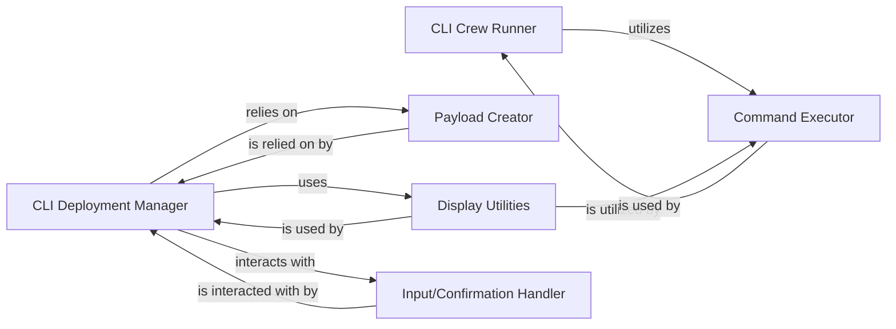

## Details

The `crewAI` CLI subsystem provides a robust command-line interface for managing and executing AI crews. It is structured around two primary entry points: the `CLI Crew Runner`, which orchestrates the execution of existing crews, and the `CLI Deployment Manager`, responsible for the entire lifecycle of deployed crews, including creation, deployment, and status monitoring. The `Command Executor` acts as a central dispatcher, abstracting and delegating the processing of various CLI commands. Data preparation for deployment is handled by the `Payload Creator`, which ensures data conforms to necessary schemas. User interaction, particularly for confirmations, is managed by the `Input/Confirmation Handler`, while all console output, including progress updates and status messages, is facilitated by the `Display Utilities`. This modular design ensures clear separation of concerns and efficient command-line operations.

### CLI Crew Runner
This component is the direct entry point for executing AI crews from the command line. It interprets user commands related to crew execution and orchestrates the initial setup for running a crew.

**Related Classes/Methods**:

- <a href="https://github.com/crewAIInc/crewAI/blob/main/src/crewai/cli/run_crew.py#L17-L47" target="_blank" rel="noopener noreferrer">`crewai.cli.run_crew.run_crew`:17-47</a>

### CLI Deployment Manager
Responsible for managing the entire lifecycle of deployed AI crews, including deployment, updates, and potentially termination. It handles the logic for preparing and sending deployment requests.

**Related Classes/Methods**:

- <a href="https://github.com/crewAIInc/crewAI/blob/main/src/crewai/cli/deploy/main.py#L12-L277" target="_blank" rel="noopener noreferrer">`crewai.cli.deploy.main.DeployCommand`:12-277</a>

### Command Executor
A utility component that abstracts and delegates the processing of various specific CLI commands. It acts as a dispatcher, routing commands to the appropriate internal handlers.

**Related Classes/Methods**:

- <a href="https://github.com/crewAIInc/crewAI/blob/main/src/crewai/cli/run_crew.py#L50-L66" target="_blank" rel="noopener noreferrer">`crewai.cli.run_crew.execute_command`:50-66</a>

### Payload Creator
This component is responsible for constructing and formatting data payloads required for deployment requests or other external interactions. It ensures that data conforms to necessary schemas and protocols.

**Related Classes/Methods**:

- <a href="https://github.com/crewAIInc/crewAI/blob/main/src/crewai/cli/deploy/main.py" target="_blank" rel="noopener noreferrer">`crewai.cli.deploy.main.DeployCommand._create_payload`</a>

### Display Utilities
Handles the formatting and output of information to the user via the command line. This includes progress updates, success/failure messages, and structured data displays.

**Related Classes/Methods**:

- <a href="https://github.com/crewAIInc/crewAI/blob/main/src/crewai/cli/deploy/main.py#L12-L277" target="_blank" rel="noopener noreferrer">`crewai.cli.deploy.main.DeployCommand`:12-277</a>
- <a href="https://github.com/crewAIInc/crewAI/blob/main/src/crewai/cli/run_crew.py#L69-L89" target="_blank" rel="noopener noreferrer">`crewai.cli.run_crew.handle_error`:69-89</a>

### Input/Confirmation Handler
Manages user input and prompts for confirmation before executing critical or irreversible actions. It ensures user intent is verified for sensitive operations.

**Related Classes/Methods**:

- <a href="https://github.com/crewAIInc/crewAI/blob/main/src/crewai/cli/deploy/main.py" target="_blank" rel="noopener noreferrer">`crewai.cli.deploy.main.DeployCommand._confirm_input`</a>

### [FAQ](https://github.com/CodeBoarding/GeneratedOnBoardings/tree/main?tab=readme-ov-file#faq)