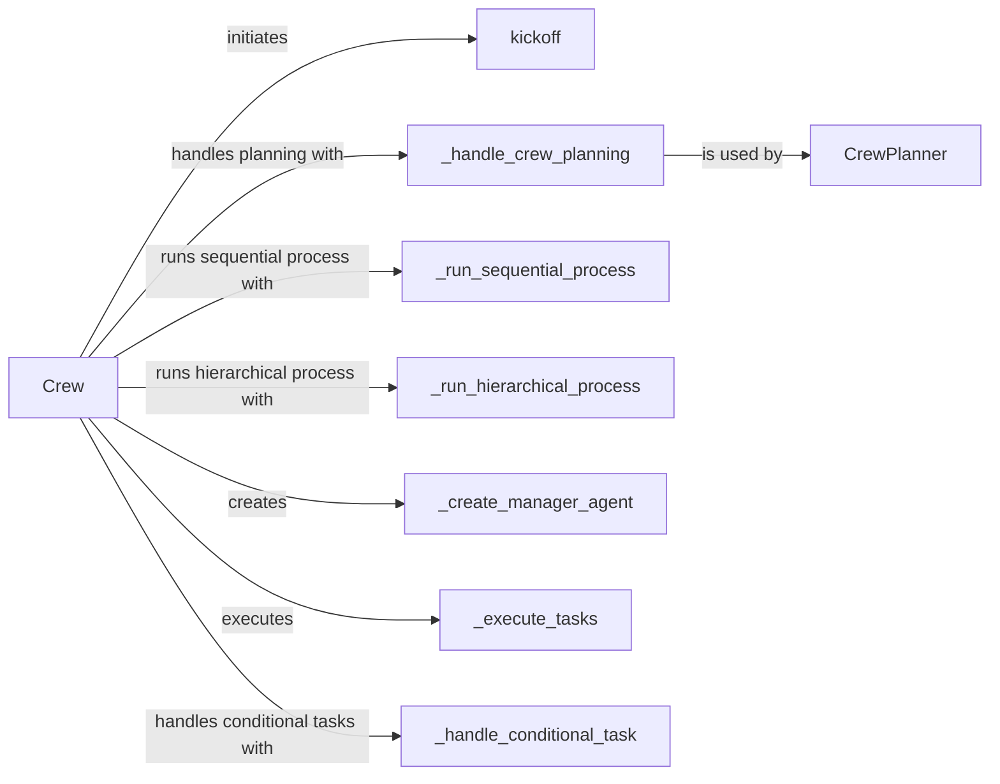

## Component Details

The CrewOrchestrator manages the execution of a crew, including agent creation, task assignment, and result aggregation. It defines the workflow and ensures that agents collaborate effectively to achieve the desired outcome. The main flow starts with the `Crew` class, which orchestrates the entire process. The `kickoff` methods initiate the crew's operation, potentially involving planning and task distribution. The `_handle_crew_planning` method orchestrates the planning phase, while `_run_sequential_process` and `_run_hierarchical_process` execute tasks in different orders. The `_create_manager_agent` method creates a manager agent, and `_execute_tasks` assigns tasks to agents and monitors their progress. Finally, `_handle_conditional_task` handles tasks that are dependent on certain conditions being met.

### Crew
The `Crew` class is the central orchestrator, responsible for managing agents, tasks, and the overall execution flow. It defines how agents collaborate to achieve a common goal, including planning, task assignment, and execution strategies.
- **Related Classes/Methods**: `crewAI.src.crewai.crew.Crew`

### kickoff
The `kickoff` method initiates the crew's operation, setting the execution flow in motion. It likely involves initial planning and task distribution among the agents.
- **Related Classes/Methods**: `crewAI.src.crewai.crew.Crew:kickoff`

### _handle_crew_planning
The `_handle_crew_planning` method is responsible for orchestrating the planning phase, potentially using a planning handler to determine the optimal task assignments and execution order.
- **Related Classes/Methods**: `crewAI.src.crewai.crew.Crew:_handle_crew_planning`, `crewAI.src.crewai.utilities.planning_handler.CrewPlanner:_handle_crew_planning`

### _run_sequential_process
The `_run_sequential_process` method executes tasks in a predefined order, ensuring that each task is completed before the next one begins. This is suitable for workflows with strict dependencies.
- **Related Classes/Methods**: `crewAI.src.crewai.crew.Crew:_run_sequential_process`

### _run_hierarchical_process
The `_run_hierarchical_process` method executes tasks in a hierarchical order, where tasks can be broken down into subtasks and assigned to different agents. This allows for more complex workflows with dependencies between tasks.
- **Related Classes/Methods**: `crewAI.src.crewai.crew.Crew:_run_hierarchical_process`

### _create_manager_agent
The `_create_manager_agent` method creates a manager agent, which is responsible for overseeing the execution of tasks and coordinating the work of other agents.
- **Related Classes/Methods**: `crewAI.src.crewai.crew.Crew:_create_manager_agent`

### _execute_tasks
The `_execute_tasks` method is the core execution loop, responsible for assigning tasks to agents and monitoring their progress. It likely involves communication with agents and handling task dependencies.
- **Related Classes/Methods**: `crewAI.src.crewai.crew.Crew:_execute_tasks`

### _handle_conditional_task
The `_handle_conditional_task` method handles tasks that are dependent on certain conditions being met. It likely involves checking the conditions and executing the task only if they are satisfied.
- **Related Classes/Methods**: `crewAI.src.crewai.crew.Crew:_handle_conditional_task`

### CrewPlanner
The `CrewPlanner` class is responsible for planning the execution of tasks, including determining the optimal task assignments and execution order.
- **Related Classes/Methods**: `crewAI.src.crewai.utilities.planning_handler.CrewPlanner`
