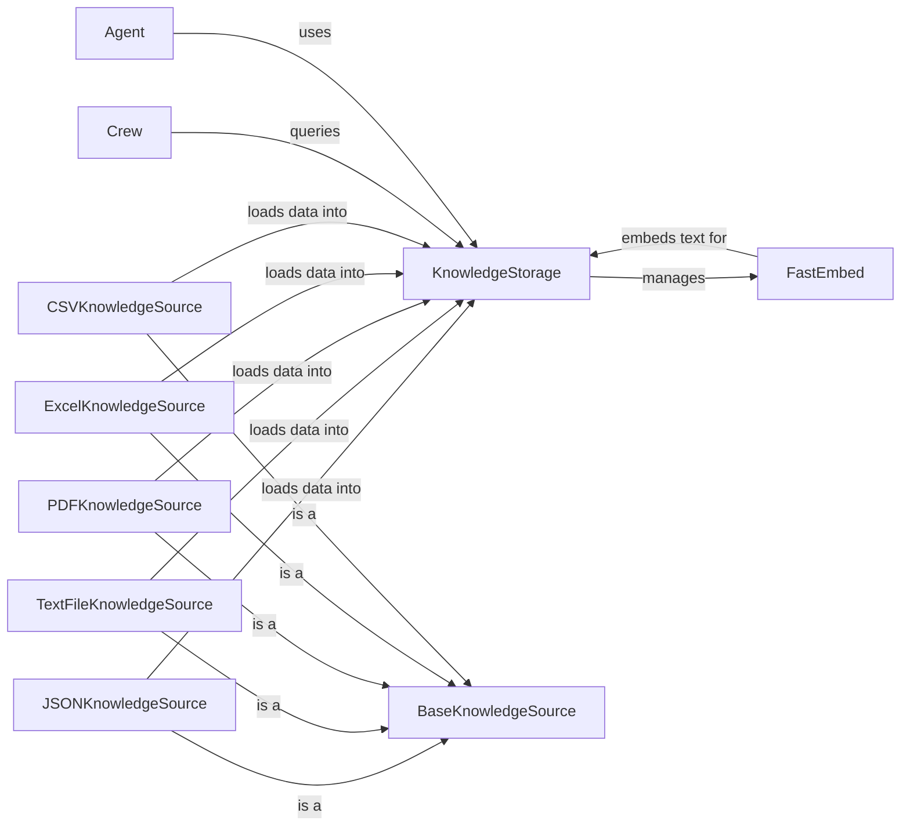

## Component Details

The Knowledge component empowers agents and crews with the ability to access and utilize external information. It encompasses the ingestion, storage, and retrieval of knowledge from various sources, enabling agents to make informed decisions and complete tasks effectively. The core flow involves loading knowledge from diverse sources into a unified storage, embedding the text for efficient similarity searches, and providing agents with the means to query and retrieve relevant information.

### KnowledgeStorage
The KnowledgeStorage component is responsible for managing the storage and retrieval of knowledge. It handles the initialization, resetting, saving, and searching of the knowledge base. It also manages the configuration of the embedder, which is used to convert text into numerical vectors for similarity searches.
- **Related Classes/Methods**: `crewai.knowledge.storage.knowledge_storage.KnowledgeStorage`

### BaseKnowledgeSource
BaseKnowledgeSource is an abstract base class that defines the interface for loading and adding knowledge to the storage. Concrete knowledge sources, such as JSONKnowledgeSource, TextFileKnowledgeSource, PDFKnowledgeSource, ExcelKnowledgeSource, and CSVKnowledgeSource, inherit from this class and implement the specific logic for loading knowledge from their respective sources.
- **Related Classes/Methods**: `crewai.knowledge.source.base_knowledge_source.BaseKnowledgeSource`

### FastEmbed
FastEmbed is used for embedding text, which is a process of converting text into numerical vectors. These vectors can then be used for similarity searches and other knowledge retrieval tasks. It is configured and managed by the KnowledgeStorage component.
- **Related Classes/Methods**: `crewai.knowledge.embedder.fastembed.FastEmbed`

### JSONKnowledgeSource
JSONKnowledgeSource loads knowledge from JSON files. It provides methods to load content, convert JSON to text, and add the knowledge to the storage.
- **Related Classes/Methods**: `crewai.knowledge.source.json_knowledge_source.JSONKnowledgeSource`

### TextFileKnowledgeSource
TextFileKnowledgeSource handles loading knowledge from text files. It provides methods to load content and add the knowledge to the storage.
- **Related Classes/Methods**: `crewai.knowledge.source.text_file_knowledge_source.TextFileKnowledgeSource`

### PDFKnowledgeSource
PDFKnowledgeSource loads knowledge from PDF files. It provides methods to load content and add the knowledge to the storage.
- **Related Classes/Methods**: `crewai.knowledge.source.pdf_knowledge_source.PDFKnowledgeSource`

### ExcelKnowledgeSource
ExcelKnowledgeSource handles loading knowledge from Excel files. It includes methods for processing file paths, validating content, loading content, and adding the knowledge to the storage.
- **Related Classes/Methods**: `crewai.knowledge.source.excel_knowledge_source.ExcelKnowledgeSource`

### CSVKnowledgeSource
CSVKnowledgeSource loads knowledge from CSV files and adds it to the storage.
- **Related Classes/Methods**: `crewai.knowledge.source.csv_knowledge_source.CSVKnowledgeSource`

### Agent
The Agent component is responsible for utilizing knowledge. It has methods to set knowledge and formulate search queries to retrieve relevant information from the knowledge base.
- **Related Classes/Methods**: `crewai.agent.agent.Agent`

### Crew
The Crew component manages the overall knowledge for a group of agents. It is responsible for creating and querying the shared knowledge base used by the agents within the crew.
- **Related Classes/Methods**: `crewai.crew.crew.Crew`
