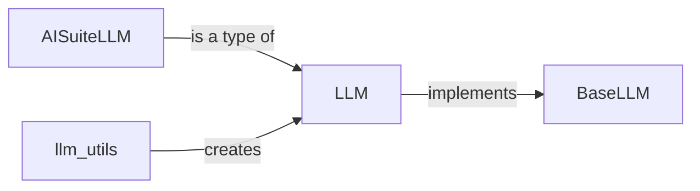

## Component Details

The LLM Interface subsystem provides a unified way to interact with various Language Models (LLMs). It abstracts the complexities of different LLM providers, handling prompt formatting, API calls, response streaming, and tool call management. The core flow involves creating an LLM instance using `llm_utils`, which selects an appropriate LLM based on configuration or falls back to a default. The `LLM` class then handles the actual interaction with the chosen LLM, preparing parameters, making API calls via a specific `BaseLLM` implementation (e.g., `AISuiteLLM`), and processing the responses, including streaming and tool calls. Callbacks are used to manage events during the LLM call lifecycle.

### LLM
The LLM component acts as the primary interface for interacting with language models. It encapsulates the logic for preparing prompts, making API calls, and handling responses, including streaming and tool calls. It supports various functionalities such as setting callbacks, validating call parameters, and handling different response types.
- **Related Classes/Methods**: `crewAI.src.crewai.llm.LLM`, `crewAI.src.crewai.llm.LLM:__init__`, `crewAI.src.crewai.llm.LLM:_prepare_completion_params`, `crewAI.src.crewai.llm.LLM:_handle_streaming_response`, `crewAI.src.crewai.llm.LLM:_handle_streaming_tool_calls`, `crewAI.src.crewai.llm.LLM:_handle_non_streaming_response`, `crewAI.src.crewai.llm.LLM:_handle_tool_call`, `crewAI.src.crewai.llm.LLM:call`, `crewAI.src.crewai.llm.LLM:_handle_emit_call_events`, `crewAI.src.crewai.llm.LLM:_validate_call_params`, `crewAI.src.crewai.llm.LLM:supports_function_calling`, `crewAI.src.crewai.llm.LLM:set_callbacks`, `crewAI.src.crewai.llm.LLM:set_env_callbacks`

### BaseLLM
BaseLLM is an abstract class that defines the interface for all LLM implementations. It provides a common set of methods for interacting with language models, ensuring that all LLM implementations adhere to a consistent API.
- **Related Classes/Methods**: `crewAI.src.crewai.llms.base_llm.BaseLLM`

### AISuiteLLM
AISuiteLLM is a concrete implementation of the BaseLLM interface that uses the AI Suite language model. It handles the specific details of communicating with the AI Suite API, including authentication and request formatting.
- **Related Classes/Methods**: `crewAI.src.crewai.llms.third_party.ai_suite.AISuiteLLM`, `crewAI.src.crewai.llms.third_party.ai_suite.AISuiteLLM:__init__`, `crewAI.src.crewai.llms.third_party.ai_suite.AISuiteLLM:call`

### llm_utils
The llm_utils module provides utility functions for creating and configuring LLMs. It encapsulates the logic for selecting an LLM based on environment variables or fallback options, simplifying the process of LLM instantiation.
- **Related Classes/Methods**: `crewAI.src.crewai.utilities.llm_utils`, `crewAI.src.crewai.utilities.llm_utils:create_llm`, `crewAI.src.crewai.utilities.llm_utils:_llm_via_environment_or_fallback`
