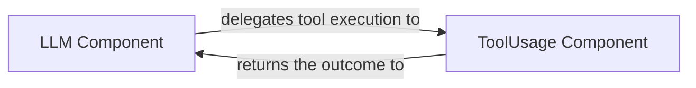

## Details

The LLM & Tool Integration subsystem is primarily defined by the src/crewai/llm.py and src/crewai/tools/tool_usage.py modules. These modules encapsulate the core logic for interacting with Large Language Models and orchestrating the use of external tools based on LLM outputs.

### LLM Component
This component acts as the primary interface for all interactions with Large Language Models. Its responsibilities include preparing prompts, managing communication with various LLM providers, processing both streaming and non-streaming responses, and critically, identifying and parsing tool-calling instructions embedded within the LLM's output. It also handles LLM-specific configurations and callback mechanisms.

**Related Classes/Methods**:

- <a href="https://github.com/crewAIInc/crewAI/blob/main/src/crewai/llm.py" target="_blank" rel="noopener noreferrer">`src.crewai.llm`</a>

### ToolUsage Component
This component is responsible for the robust execution of external tools. Its functions include parsing detailed tool-calling instructions received from the LLM component, validating the inputs required by the tools, executing the selected tool, formatting the tool's output for consumption by the LLM, and comprehensive error handling during tool execution. It also incorporates mechanisms for managing tool usage limits and preventing redundant tool calls.

**Related Classes/Methods**:

- <a href="https://github.com/crewAIInc/crewAI/blob/main/src/crewai/tools/tool_usage.py" target="_blank" rel="noopener noreferrer">`src.crewai.tools.tool_usage`</a>

### [FAQ](https://github.com/CodeBoarding/GeneratedOnBoardings/tree/main?tab=readme-ov-file#faq)