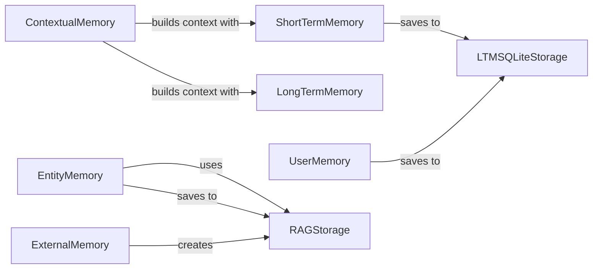

## Component Details

The Memory component in CrewAI provides a comprehensive memory management system for agents, enabling them to store, retrieve, and contextualize information. It encompasses short-term, long-term, entity, external, and user-specific memories, facilitating learning and adaptation over time. The core functionality revolves around storing and retrieving information using various storage mechanisms like SQLite and vector embeddings, and contextualizing this information to provide relevant context for agent tasks.

### ShortTermMemory
Manages the agent's short-term memory, storing recent interactions and information for immediate access. It uses LTMSQLiteStorage for persisting short-term memory.
- **Related Classes/Methods**: `crewai.memory.short_term.short_term_memory.ShortTermMemory`

### LongTermMemory
Handles the agent's long-term memory, storing persistent knowledge and experiences. It interacts with ContextualMemory to provide context for tasks.
- **Related Classes/Methods**: `crewai.memory.long_term.long_term_memory.LongTermMemory`

### EntityMemory
Stores information about entities recognized by the agent, using RAGStorage for saving and searching entities.
- **Related Classes/Methods**: `crewai.memory.entity.entity_memory.EntityMemory`

### ExternalMemory
Manages external memory sources for agents, configuring Mem0 and creating RAG storage. It interacts with Mem0Storage and RAGStorage.
- **Related Classes/Methods**: `crewai.memory.external.external_memory.ExternalMemory`

### UserMemory
Stores user-specific information, interacting with LTMSQLiteStorage for persistence.
- **Related Classes/Methods**: `crewai.memory.user.user_memory.UserMemory`

### RAGStorage
Implements Retrieval-Augmented Generation storage using embeddings, handling saving, searching, and resetting the storage. It initializes BaseRAGStorage.
- **Related Classes/Methods**: `crewai.memory.storage.rag_storage.RAGStorage`

### LTMSQLiteStorage
Implements long-term memory storage using SQLite, handling initializing the database, saving, loading, and resetting data. It is used by UserMemory and ShortTermMemory.
- **Related Classes/Methods**: `crewai.memory.storage.ltm_sqlite_storage.LTMSQLiteStorage`

### ContextualMemory
Builds context for tasks by retrieving relevant information from memory, using LongTermMemory and ShortTermMemory.
- **Related Classes/Methods**: `crewai.memory.contextual.contextual_memory.ContextualMemory`
