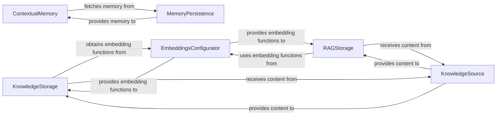

## Details

One paragraph explaining the functionality which is represented by this graph. What the main flow is and what is its purpose.

### ContextualMemory
The orchestrator for aggregating diverse memory types (entity, short-term, long-term, external, and task outputs) to construct a holistic context for agents and tasks. This is crucial for agents to maintain coherence and relevance in their operations.

**Related Classes/Methods**:

- <a href="https://github.com/crewAIInc/crewAI/blob/main/src/crewai/memory/contextual/contextual_memory.py" target="_blank" rel="noopener noreferrer">`crewai.memory.contextual.contextual_memory`</a>

### KnowledgeStorage
Manages the core functionalities for storing and searching general knowledge, serving as a foundational knowledge base for agents.

**Related Classes/Methods**:

- <a href="https://github.com/crewAIInc/crewAI/blob/main/src/crewai/knowledge/storage/knowledge_storage.py" target="_blank" rel="noopener noreferrer">`crewai.knowledge.storage.knowledge_storage`</a>

### RAGStorage
Provides specialized storage and retrieval mechanisms tailored for Retrieval-Augmented Generation (RAG), enabling agents to access and integrate external knowledge efficiently.

**Related Classes/Methods**:

- <a href="https://github.com/crewAIInc/crewAI/blob/main/src/crewai/memory/storage/rag_storage.py" target="_blank" rel="noopener noreferrer">`crewai.memory.storage.rag_storage`</a>

### EmbeddingsConfigurator
A utility component responsible for configuring and providing various embedding functions, abstracting away the complexities of different LLM providers.

**Related Classes/Methods**:

- <a href="https://github.com/crewAIInc/crewAI/blob/main/src/crewai/rag/embeddings/configurator.py" target="_blank" rel="noopener noreferrer">`crewai.rag.embeddings.configurator`</a>

### KnowledgeSource
A collection of classes dedicated to loading, validating, and chunking content from diverse data sources into a format suitable for the knowledge base. This is critical for ingesting information into the system.

**Related Classes/Methods**:

- <a href="https://github.com/crewAIInc/crewAI/blob/main/src/crewai/knowledge/source" target="_blank" rel="noopener noreferrer">`crewai.knowledge.source`</a>

### MemoryPersistence
Represents the various concrete implementations for persisting different types of memory, including long-term memory (SQLite), Mem0-managed memory, external memory solutions, and initial task outputs. It provides the underlying storage mechanisms for `ContextualMemory`.

**Related Classes/Methods**:

- <a href="https://github.com/crewAIInc/crewAI/blob/main/src/crewai/memory/storage/mem0_storage.py" target="_blank" rel="noopener noreferrer">`crewai.memory.storage.mem0_storage`</a>
- <a href="https://github.com/crewAIInc/crewAI/blob/main/src/crewai/memory/storage/ltm_sqlite_storage.py" target="_blank" rel="noopener noreferrer">`crewai.memory.storage.ltm_sqlite_storage`</a>
- <a href="https://github.com/crewAIInc/crewAI/blob/main/src/crewai/memory/storage/kickoff_task_outputs_storage.py" target="_blank" rel="noopener noreferrer">`crewai.memory.storage.kickoff_task_outputs_storage`</a>

### [FAQ](https://github.com/CodeBoarding/GeneratedOnBoardings/tree/main?tab=readme-ov-file#faq)