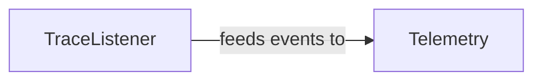

## Details

The `Observability & Telemetry` subsystem is responsible for capturing, processing, and emitting detailed execution events within the `crewAI` framework. Its primary goal is to provide insights into the system's behavior, performance, and debugging information without interfering with core business logic.

### TraceListener
Acts as the central event capture mechanism. Its primary role is to listen for and capture detailed execution events originating from various components of the AI agent orchestration (e.g., agent actions, task execution, LLM calls, tool usage, memory operations, guardrail checks, reasoning steps). It standardizes these events for subsequent processing.

**Related Classes/Methods**:

- <a href="https://github.com/crewAIInc/crewAI/blob/main/src/crewai/utilities/events/listeners/tracing/trace_listener.py" target="_blank" rel="noopener noreferrer">`src/crewai/utilities/events/listeners/tracing/trace_listener.py`</a>

### Telemetry [[Expand]](./Telemetry.md)
Manages the overall telemetry lifecycle and data emission. This includes controlling the global enablement/disablement of telemetry, configuring and initializing tracing infrastructure (e.g., OpenTelemetry), processing the raw events received from `TraceListener`, and emitting them to external monitoring or analysis systems. It is also responsible for managing tracing spans to provide performance insights and contextual debugging.

**Related Classes/Methods**:

- <a href="https://github.com/crewAIInc/crewAI/blob/main/src/crewai/telemetry/telemetry.py" target="_blank" rel="noopener noreferrer">`src/crewai/telemetry/telemetry.py`</a>

### [FAQ](https://github.com/CodeBoarding/GeneratedOnBoardings/tree/main?tab=readme-ov-file#faq)