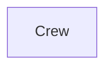

## Details

Analysis of the system architecture focusing on the Crew component and its interactions.

### Crew
The central orchestrator of the system, responsible for managing and coordinating tasks.

**Related Classes/Methods**:

- <a href="https://github.com/crewAIInc/crewAI/blob/main/src/crewai/crew.py" target="_blank" rel="noopener noreferrer">`crewai.crew.Crew`</a>

### [FAQ](https://github.com/CodeBoarding/GeneratedOnBoardings/tree/main?tab=readme-ov-file#faq)