```mermaid
graph LR
    Agent_execute_task["Agent:execute_task"]
    Task_execute_sync["Task:execute_sync"]
    Task__execute_task_async["Task:_execute_task_async"]
    Task__execute_core["Task:_execute_core"]
    Task_prompt["Task:prompt"]
    Task_interpolate_inputs_and_add_conversation_history["Task:interpolate_inputs_and_add_conversation_history"]
    Task__process_guardrail["Task:_process_guardrail"]
    LLMGuardrail___call__["LLMGuardrail:__call__"]
    LLMGuardrail__validate_output["LLMGuardrail:_validate_output"]
    ConditionalTask_get_skipped_task_output["ConditionalTask:get_skipped_task_output"]
    Agent_execute_task -- "executes" --> Task_execute_sync
    Task_execute_sync -- "executes asynchronously" --> Task__execute_task_async
    Task__execute_task_async -- "executes core logic" --> Task__execute_core
    Task__execute_core -- "generates prompt" --> Task_prompt
    Task_prompt -- "interpolates inputs and adds conversation history" --> Task_interpolate_inputs_and_add_conversation_history
    Task__execute_core -- "processes guardrail" --> Task__process_guardrail
    Task__process_guardrail -- "validates output" --> LLMGuardrail___call__
    LLMGuardrail___call__ -- "validates output" --> LLMGuardrail__validate_output
    Task__execute_core -- "gets skipped task output" --> ConditionalTask_get_skipped_task_output
```

## Component Details

The TaskManager component orchestrates the execution of tasks within the CrewAI framework. It begins with an agent initiating a task, which is then executed synchronously. The synchronous execution manages the asynchronous execution of the core task logic, including prompt generation, input interpolation, and guardrail processing. The guardrail processing validates the task's output against defined safety and compliance rules. Conditional tasks allow for skipping tasks based on certain conditions, with mechanisms to retrieve the output of skipped tasks. This entire process ensures that tasks are completed efficiently, safely, and in accordance with the defined workflow.

### Agent:execute_task
This component initiates the task execution process for an agent. It prepares the task and orchestrates its execution, handing off to the synchronous task execution component.
- **Related Classes/Methods**: `crewai.agent.Agent:execute_task`

### Task:execute_sync
This component provides a synchronous entry point for task execution, ensuring the task completes before proceeding. It manages the asynchronous execution of the task's core logic.
- **Related Classes/Methods**: `crewai.task.Task:execute_sync`

### Task:_execute_task_async
This component handles the asynchronous execution of the task, allowing for concurrent task processing and improved performance. It triggers the core task execution logic.
- **Related Classes/Methods**: `crewai.task.Task:_execute_task_async`

### Task:_execute_core
This component contains the core logic for executing a task, including running the tool and processing the output. It also handles prompt generation and guardrail processing.
- **Related Classes/Methods**: `crewai.task.Task:_execute_core`

### Task:prompt
This component generates the prompt for the task, incorporating task instructions and relevant context. It uses input interpolation and conversation history to create a comprehensive prompt.
- **Related Classes/Methods**: `crewai.task.Task:prompt`

### Task:interpolate_inputs_and_add_conversation_history
This component interpolates the inputs for the task and adds the conversation history to the prompt, ensuring all necessary information is included for correct execution.
- **Related Classes/Methods**: `crewai.task.Task:interpolate_inputs_and_add_conversation_history`

### Task:_process_guardrail
This component processes the guardrail associated with a task, ensuring the output is safe and compliant. It validates the output against defined guardrails using the LLMGuardrail component.
- **Related Classes/Methods**: `crewai.task.Task:_process_guardrail`

### LLMGuardrail:__call__
This component acts as the entry point for validating task output against guardrails. It triggers the validation process to ensure safety and compliance.
- **Related Classes/Methods**: `crewai.tasks.llm_guardrail.LLMGuardrail:__call__`

### LLMGuardrail:_validate_output
This component validates the task output against the defined guardrails, ensuring it is safe and compliant before being used.
- **Related Classes/Methods**: `crewai.tasks.llm_guardrail.LLMGuardrail:_validate_output`

### ConditionalTask:get_skipped_task_output
This component retrieves the output of a skipped task, allowing the workflow to continue even if a task is skipped due to unmet conditions.
- **Related Classes/Methods**: `crewai.tasks.conditional_task.ConditionalTask:get_skipped_task_output`
