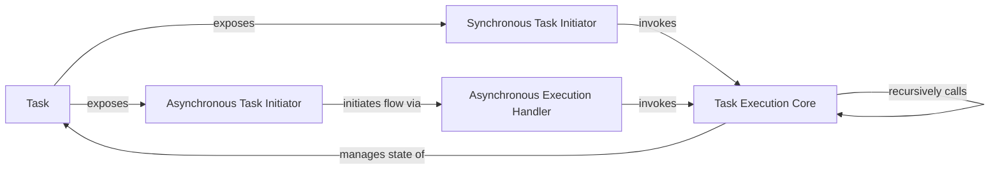

## Details

The Task Execution Layer is primarily defined by the task.py module within the crewAI project. Its core responsibility is to manage the lifecycle, execution, and output handling of individual tasks assigned to agents. This layer encapsulates the logic for how a task is defined, initiated, processed, and completed, serving as the operational backbone for task-level automation.

### Task
This is the foundational component representing an individual unit of work. It encapsulates the task's definition (e.g., description, expected output, assigned agent, tools), its current state, and provides the primary interface for managing its lifecycle. It acts as the central data structure and control point for task execution within the subsystem.

**Related Classes/Methods**:

- <a href="https://github.com/crewAIInc/crewAI/blob/main/src/crewai/task.py#L56-L791" target="_blank" rel="noopener noreferrer">`crewai.task.Task`:56-791</a>

### Task Execution Core
This is the internal, core execution engine for any task. It orchestrates the fundamental steps required to process a task, including managing the task's output, handling file operations, and potentially interacting with LLMs or external tools. Its design suggests reusability and potential for recursive calls to handle complex or iterative task flows.

**Related Classes/Methods**:

- <a href="https://github.com/crewAIInc/crewAI/blob/main/src/crewai/task.py" target="_blank" rel="noopener noreferrer">`crewai.task.Task:_execute_core`</a>

### Synchronous Task Initiator
Provides a synchronous public interface for initiating a task's execution. This is a straightforward, blocking entry point for immediate task processing, suitable for sequential workflows.

**Related Classes/Methods**:

- <a href="https://github.com/crewAIInc/crewAI/blob/main/src/crewai/task.py" target="_blank" rel="noopener noreferrer">`crewai.task.Task:execute_sync`</a>

### Asynchronous Task Initiator
Provides an asynchronous public interface for initiating a task's execution. This is crucial for an orchestration framework, enabling non-blocking task processing and supporting concurrency across multiple agents or tasks.

**Related Classes/Methods**:

- <a href="https://github.com/crewAIInc/crewAI/blob/main/src/crewai/task.py" target="_blank" rel="noopener noreferrer">`crewai.task.Task:execute_async`</a>

### Asynchronous Execution Handler
An internal handler specifically designed to manage the asynchronous flow of task execution. It sets up and manages the asynchronous context for the core execution logic, ensuring proper non-blocking operation.

**Related Classes/Methods**:

- <a href="https://github.com/crewAIInc/crewAI/blob/main/src/crewai/task.py" target="_blank" rel="noopener noreferrer">`crewai.task.Task:_execute_task_async`</a>

### [FAQ](https://github.com/CodeBoarding/GeneratedOnBoardings/tree/main?tab=readme-ov-file#faq)