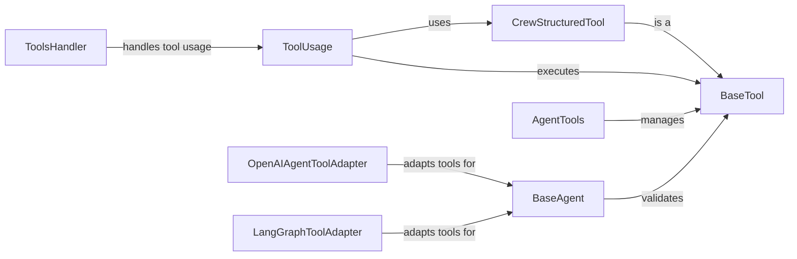

## Component Details

The Tooling component in CrewAI is responsible for managing and executing tools available to agents. It provides a structured and consistent way for agents to interact with external resources and perform tasks. The component encompasses tool definition, registration, input validation, execution, and result formatting, ensuring seamless integration of tools into the agent's workflow. It also includes adapters for different agent frameworks like OpenAI and LangGraph.

### BaseTool
The BaseTool class serves as the foundation for all tools within the CrewAI framework. It defines the core interface and provides common functionalities such as running the tool, converting it to a structured format suitable for LLMs, and generating descriptions for tool usage. All custom tools should inherit from this class to ensure compatibility and consistency within the system.
- **Related Classes/Methods**: `crewai.tools.base_tool.BaseTool`

### CrewStructuredTool
CrewStructuredTool extends the BaseTool class, providing a structured interface for tool interaction. This allows for more precise control over tool execution and input/output handling, especially when dealing with complex data structures. It facilitates the creation of tools that can seamlessly integrate with LLMs and other components of the CrewAI system.
- **Related Classes/Methods**: `crewai.tools.structured_tool.CrewStructuredTool`

### ToolUsage
The ToolUsage class is central to managing the execution of tools. It handles parsing tool calling requests, validating input against the tool's schema, executing the tool, formatting the result, and managing any errors that may occur. It acts as an intermediary between the agent and the specific tool, ensuring that the tool is used correctly and efficiently.
- **Related Classes/Methods**: `crewai.tools.tool_usage.ToolUsage`

### AgentTools
The AgentTools class is a utility that manages the available tools for an agent. It provides methods for initializing, accessing, and retrieving tools associated with an agent. This class simplifies the process of equipping agents with the necessary tools for their tasks and ensures that the tools are readily available when needed.
- **Related Classes/Methods**: `crewai.tools.agent_tools.agent_tools.AgentTools`

### ToolsHandler
The ToolsHandler class is responsible for handling the usage of tools by agents. This includes logging tool usage, managing tool-related events, and performing any other necessary actions when a tool is used. It provides a centralized point for managing tool interactions and ensuring that they are properly tracked and handled.
- **Related Classes/Methods**: `crewai.agents.tools_handler.ToolsHandler`

### OpenAIAgentToolAdapter
The OpenAIAgentToolAdapter class adapts tools to be compatible with the OpenAI agent format. It configures the tools and converts them into the format expected by OpenAI's models, enabling seamless integration of CrewAI tools with OpenAI-based agents. This adapter ensures that the tools can be used effectively within the OpenAI ecosystem.
- **Related Classes/Methods**: `crewai.agents.agent_adapters.openai_agents.openai_agent_tool_adapter.OpenAIAgentToolAdapter`

### LangGraphToolAdapter
The LangGraphToolAdapter class adapts tools to be compatible with the LangGraph framework. It configures the tools and converts them into the format expected by LangGraph, enabling seamless integration of CrewAI tools with LangGraph-based agents. This adapter ensures that the tools can be used effectively within the LangGraph ecosystem.
- **Related Classes/Methods**: `crewai.agents.agent_adapters.langgraph.langgraph_tool_adapter.LangGraphToolAdapter`

### BaseAgent
The BaseAgent class serves as the foundation for all agents within the CrewAI framework. It validates the tools that are being used by the agent.
- **Related Classes/Methods**: `crewai.agents.agent_builder.base_agent.BaseAgent`
