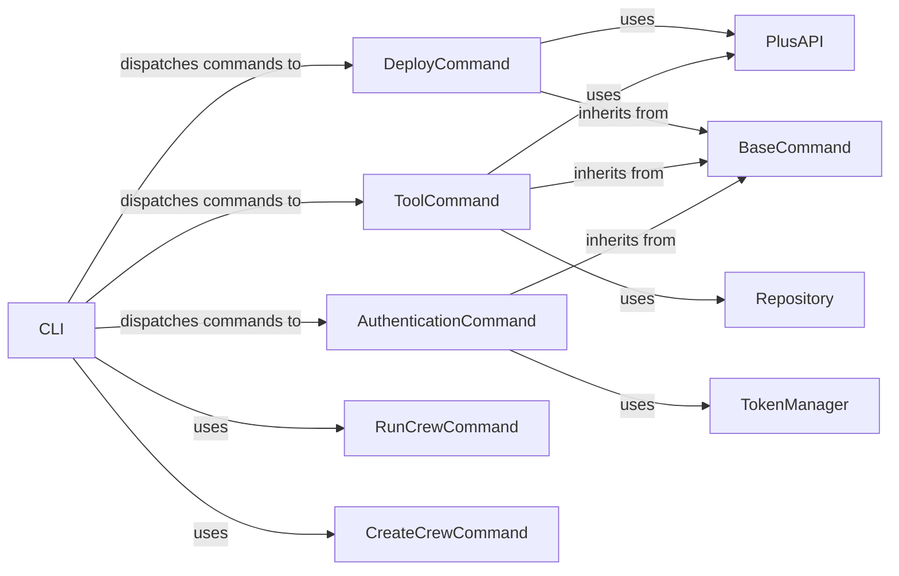

## Component Details

The UserInterface component provides a command-line interface (CLI) for interacting with the CrewAI system. It allows users to manage crews, tools, and authentication, as well as deploy and run crews. The CLI uses the Typer library to define the command structure and dispatches commands to the appropriate handlers. It interacts with the CrewAI Plus API for deployment and tool management and uses a TokenManager for authentication. The CLI also provides commands for creating, running, and updating crews, as well as resetting memories.

### CLI
The main entry point for the CLI. It defines the command structure using `typer` and dispatches commands to the appropriate handlers.
- **Related Classes/Methods**: `crewai.cli.cli`

### DeployCommand
Handles deployment-related commands, such as creating, listing, and removing crews. It interacts with the CrewAI Plus API to perform these operations.
- **Related Classes/Methods**: `crewai.cli.deploy.main`

### ToolCommand
Handles tool-related commands, such as creating, installing, and publishing tools. It interacts with the CrewAI Plus API and the git repository to manage tools.
- **Related Classes/Methods**: `crewai.cli.tools.main`

### AuthenticationCommand
Handles user authentication commands, such as signup and login. It uses the TokenManager to store and retrieve authentication tokens.
- **Related Classes/Methods**: `crewai.cli.authentication.main`

### PlusAPI
Interacts with the CrewAI Plus API for tasks such as deploying crews and managing tools. It provides methods for creating, listing, and removing crews and tools.
- **Related Classes/Methods**: `crewai.cli.plus_api`

### TokenManager
Manages authentication tokens, including saving and retrieving them securely. It uses a file to store the tokens.
- **Related Classes/Methods**: `crewai.cli.authentication.utils`

### RunCrewCommand
Executes a crew based on a configuration file.
- **Related Classes/Methods**: `crewai.cli.run_crew`

### CreateCrewCommand
Creates a new crew based on a template.
- **Related Classes/Methods**: `crewai.cli.create_crew`

### Repository
Manages git repository operations, such as cloning and pulling repositories.
- **Related Classes/Methods**: `crewai.cli.git`

### BaseCommand
Base class for commands, providing common functionality such as error handling and utility functions.
- **Related Classes/Methods**: `crewai.cli.command`
