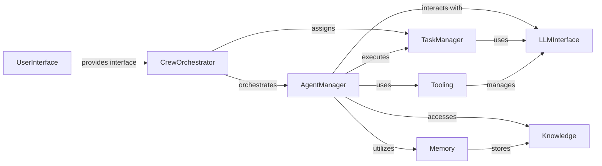

## Component Details

The CrewAI system orchestrates collaborative tasks among autonomous agents to achieve complex goals. The core flow involves defining a crew of specialized agents, assigning them individual tasks, and managing their interactions to produce a final result. This includes leveraging language models, tools, and memory to enable agents to reason, act, and learn throughout the process.

### CrewOrchestrator
The CrewOrchestrator component manages the overall execution of a crew, including agent creation, task assignment, and result aggregation. It defines the workflow and ensures that agents collaborate effectively to achieve the desired outcome. It is the central point of control for the entire CrewAI system.
- **Related Classes/Methods**: `crewai.crew.Crew`, `crewai.process`, `crewai.utilities.planning_handler.CrewPlanner`

### AgentManager
The AgentManager component is responsible for defining and managing individual agents within a crew. It handles agent initialization, tool assignment, task execution, and interaction with the language model. It provides the building blocks for creating intelligent and autonomous agents.
- **Related Classes/Methods**: `crewai.agent.Agent`, `crewai.agents.agent_builder.base_agent.BaseAgent`, `crewai.agents.agent_adapters.openai_agents.openai_adapter.OpenAIAgentAdapter`, `crewai.agents.agent_adapters.langgraph.langgraph_adapter.LangGraphAgentAdapter`

### TaskManager
The TaskManager component defines and executes individual tasks assigned to agents. It manages task execution, input interpolation, guardrail processing, and output formatting. It ensures that tasks are completed efficiently and effectively.
- **Related Classes/Methods**: `crewai.task.Task`, `crewai.tasks.llm_guardrail.LLMGuardrail`, `crewai.tasks.conditional_task.ConditionalTask`

### LLMInterface
The LLMInterface component provides an interface for interacting with language models. It handles prompt preparation, API calls, streaming responses, and tool call management. It abstracts away the complexities of interacting with different language models.
- **Related Classes/Methods**: `crewai.llm.LLM`, `crewai.llms.base_llm.BaseLLM`, `crewai.llms.third_party.ai_suite.AISuiteLLM`, `crewai.utilities.llm_utils`

### Tooling
The Tooling component manages the tools available to agents. It handles tool registration, execution, input validation, and result formatting. It provides agents with the capabilities they need to interact with the external world.
- **Related Classes/Methods**: `crewai.tools.base_tool.BaseTool`, `crewai.tools.structured_tool.CrewStructuredTool`, `crewai.tools.tool_usage.ToolUsage`, `crewai.tools.agent_tools.agent_tools.AgentTools`

### Memory
The Memory component provides memory capabilities for agents and crews, including short-term, long-term, and entity memories. It handles memory storage, retrieval, and contextualization. It allows agents to learn and adapt over time.
- **Related Classes/Methods**: `crewai.memory.short_term.short_term_memory.ShortTermMemory`, `crewai.memory.long_term.long_term_memory.LongTermMemory`, `crewai.memory.entity.entity_memory.EntityMemory`, `crewai.memory.external.external_memory.ExternalMemory`, `crewai.memory.user.user_memory.UserMemory`, `crewai.memory.storage.rag_storage.RAGStorage`, `crewai.memory.contextual.contextual_memory.ContextualMemory`

### Knowledge
The Knowledge component manages the knowledge sources available to agents. It handles knowledge ingestion, storage, and retrieval. It provides agents with access to the information they need to complete their tasks.
- **Related Classes/Methods**: `crewai.knowledge.knowledge.Knowledge`, `crewai.knowledge.source.base_knowledge_source.BaseKnowledgeSource`, `crewai.knowledge.storage.knowledge_storage.KnowledgeStorage`, `crewai.knowledge.embedder.fastembed.FastEmbed`

### UserInterface
The UserInterface component provides interfaces for interacting with the CrewAI system, including a command-line interface (CLI) and potentially other interfaces. It handles crew creation, execution, deployment, and other management tasks. It allows users to easily manage and interact with the CrewAI system.
- **Related Classes/Methods**: `crewai.cli.cli.CLI`, `crewai.cli.create_crew.CreateCrew`, `crewai.cli.run_crew.RunCrew`, `crewai.cli.deploy.main.DeployCommand`, `crewai.cli.tools.main.ToolCommand`