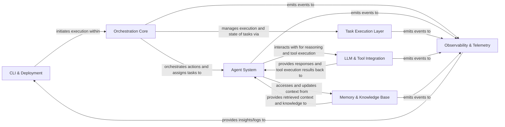

## Details

The `crewAI` architecture is designed as an intelligent AI Agent Orchestration Framework, centered around the **Orchestration Core** which manages the execution of multi-agent workflows. User interaction begins with the **CLI & Deployment** component, initiating a `Crew` or `Flow` that the Orchestration Core then manages. Within this orchestration, individual **Agent System** instances perform tasks, leveraging the **LLM & Tool Integration** layer for their reasoning and external interactions, and drawing upon the **Memory & Knowledge Base** for contextual awareness and information retrieval. The **Task Execution Layer** ensures efficient task management throughout the workflow. All critical activities across these components are monitored by the **Observability & Telemetry** system, providing comprehensive insights into the framework's operation. This modular design facilitates clear data and control flow, making it ideal for visual representation in a flow graph diagram.

### CLI & Deployment [[Expand]](./CLI_Deployment.md)
The user's primary interface for initiating, configuring, and deploying AI crews and flows.

**Related Classes/Methods**:

- <a href="https://github.com/crewAIInc/crewAI/blob/main/src/crewai/cli/run_crew.py" target="_blank" rel="noopener noreferrer">`run_crew.py`</a>
- <a href="https://github.com/crewAIInc/crewAI/blob/main/src/crewai/cli/deploy/main.py" target="_blank" rel="noopener noreferrer">`main.py`</a>

### Orchestration Core [[Expand]](./Orchestration_Core.md)
The central workflow engine responsible for defining, managing, and executing multi-agent crews and complex flows.

**Related Classes/Methods**:

- <a href="https://github.com/crewAIInc/crewAI/blob/main/src/crewai/crew.py" target="_blank" rel="noopener noreferrer">`crew.py`</a>
- <a href="https://github.com/crewAIInc/crewAI/blob/main/src/crewai/flow/flow.py" target="_blank" rel="noopener noreferrer">`flow.py`</a>

### Agent System [[Expand]](./Agent_System.md)
Encapsulates the intelligence, roles, and decision-making logic of individual AI agents within a crew.

**Related Classes/Methods**:

- <a href="https://github.com/crewAIInc/crewAI/blob/main/src/crewai/lite_agent.py" target="_blank" rel="noopener noreferrer">`agent.py`</a>
- <a href="https://github.com/crewAIInc/crewAI/blob/main/src/crewai/utilities/reasoning_handler.py" target="_blank" rel="noopener noreferrer">`reasoning_handler.py`</a>

### Task Execution Layer [[Expand]](./Task_Execution_Layer.md)
Manages the lifecycle, execution, and output handling of individual tasks assigned to agents.

**Related Classes/Methods**:

- <a href="https://github.com/crewAIInc/crewAI/blob/main/src/crewai/task.py" target="_blank" rel="noopener noreferrer">`task.py`</a>

### LLM & Tool Integration [[Expand]](./LLM_Tool_Integration.md)
Provides a unified interface for agents to interact with Large Language Models and external tools for reasoning and action.

**Related Classes/Methods**:

- <a href="https://github.com/crewAIInc/crewAI/blob/main/src/crewai/llm.py" target="_blank" rel="noopener noreferrer">`llm.py`</a>
- <a href="https://github.com/crewAIInc/crewAI/blob/main/src/crewai/tools/tool_usage.py" target="_blank" rel="noopener noreferrer">`tool_usage.py`</a>

### Memory & Knowledge Base [[Expand]](./Memory_Knowledge_Base.md)
Manages all forms of information storage and retrieval, including contextual memory and RAG-based knowledge access for agents and crews.

**Related Classes/Methods**:

- <a href="https://github.com/crewAIInc/crewAI/blob/main/src/crewai/memory/contextual/contextual_memory.py" target="_blank" rel="noopener noreferrer">`contextual_memory.py`</a>
- <a href="https://github.com/crewAIInc/crewAI/blob/main/src/crewai/knowledge/storage/knowledge_storage.py" target="_blank" rel="noopener noreferrer">`knowledge_storage.py`</a>

### Observability & Telemetry [[Expand]](./Observability_Telemetry.md)
A cross-cutting component for capturing and emitting detailed execution events for monitoring, debugging, and performance analysis.

**Related Classes/Methods**:

- <a href="https://github.com/crewAIInc/crewAI/blob/main/src/crewai/utilities/events/listeners/tracing/trace_listener.py" target="_blank" rel="noopener noreferrer">`trace_listener.py`</a>
- <a href="https://github.com/crewAIInc/crewAI/blob/main/src/crewai/telemetry/telemetry.py" target="_blank" rel="noopener noreferrer">`telemetry.py`</a>

### [FAQ](https://github.com/CodeBoarding/GeneratedOnBoardings/tree/main?tab=readme-ov-file#faq)