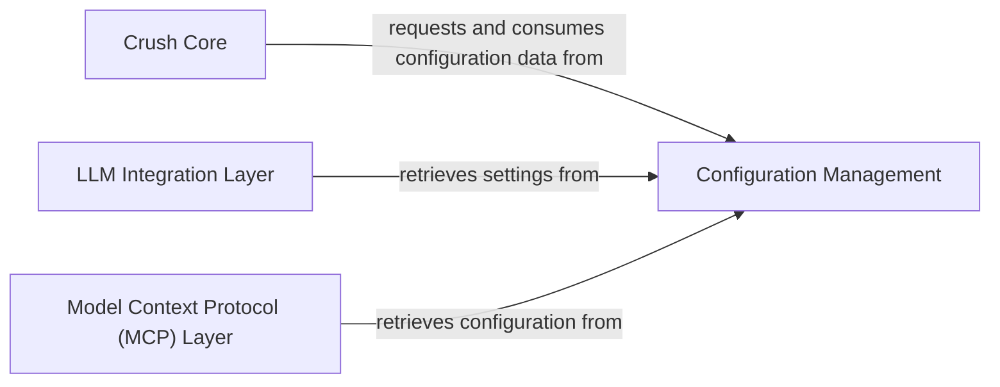

## Details

One paragraph explaining the functionality which is represented by this graph. What the main flow is and what is its purpose.

### Configuration Management [[Expand]](./Configuration_Management.md)
Responsible for loading, merging, and validating application configurations from various sources, including API keys, model preferences, LSP paths, LLM-specific settings, and context provider settings. This is critical for a CLI tool that needs to manage settings and for an AI/ML tool to manage different LLM providers, API keys, model parameters, and paths to local models or context providers.

**Related Classes/Methods**:

- `internal/config/config.go`
- `internal/config/load.go`
- `internal/config/merge.go`

### Crush Core
Represents the central or core logic of the application, responsible for orchestrating main functionalities and consuming configuration data to operate effectively.

**Related Classes/Methods**: _None_

### LLM Integration Layer [[Expand]](./LLM_Integration_Layer.md)
Manages interactions with Large Language Models (LLMs), including retrieving necessary settings (e.g., API keys, model identifiers, specific parameters) from the Configuration Management to facilitate communication and operation with various LLM providers.

**Related Classes/Methods**: _None_

### Model Context Protocol (MCP) Layer [[Expand]](./Model_Context_Protocol_MCP_Layer.md)
Handles the management and application of context for models, ensuring that models receive and process input correctly based on retrieved configuration settings.

**Related Classes/Methods**: _None_

### [FAQ](https://github.com/CodeBoarding/GeneratedOnBoardings/tree/main?tab=readme-ov-file#faq)