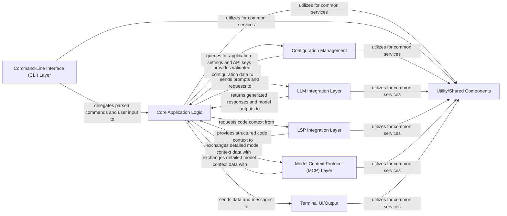

## Details

Abstract Components Overview

### Core Application Logic [[Expand]](./Core_Application_Logic.md)
The central orchestrator, managing sessions, maintaining context, and coordinating interactions between all other components. It processes user requests and directs them to appropriate backend services.

**Related Classes/Methods**:

- `internal/app/app.go` (1:1)
- `internal/app/lsp.go` (1:1)

### Command-Line Interface (CLI) Layer
Responsible for parsing command-line arguments, handling subcommands, and managing user input. It serves as the primary interface for user interaction.

**Related Classes/Methods**:

- `cmd/root.go` (1:1)
- `cmd/generate.go` (1:1)

### Configuration Management [[Expand]](./Configuration_Management.md)
Handles loading, merging, and validating application configurations from various sources (e.g., local files, environment variables, global settings).

**Related Classes/Methods**:

- `internal/config/config.go` (1:1)

### LLM Integration Layer [[Expand]](./LLM_Integration_Layer.md)
Provides an abstraction layer for interacting with various Large Language Model (LLM) providers (e.g., OpenAI, Anthropic, Google Gemini). It manages API calls, request/response formatting, and provider-specific error handling.

**Related Classes/Methods**:

- `internal/llm/provider.go` (1:1)
- `internal/llm/openai.go` (1:1)

### LSP Integration Layer [[Expand]](./LSP_Integration_Layer.md)
Manages connections with Language Server Protocol (LSP) clients, sending requests for code context (e.g., definitions, references) and processing their responses.

**Related Classes/Methods**:

- `internal/lsp/client.go` (1:1)
- `internal/lsp/protocol.go` (1:1)

### Model Context Protocol (MCP) Layer [[Expand]](./Model_Context_Protocol_MCP_Layer.md)
Manages interactions with Model Context Protocol (MCP) servers, supporting various transport types (stdio, HTTP, SSE) for efficient data exchange related to model context.

**Related Classes/Methods**:

- `internal/mcp/server.go` (1:1)
- `internal/mcp/http.go` (1:1)

### Terminal UI/Output [[Expand]](./Terminal_UI_Output.md)
Responsible for rendering all application output to the terminal, ensuring a consistent, readable, and user-friendly experience.

**Related Classes/Methods**:

- `internal/ui/printer.go` (1:1)
- `internal/ui/styles.go` (1:1)

### Utility/Shared Components
Contains common functionalities and helper modules used across multiple components, such as logging, error handling, data structures, and general-purpose utilities.

**Related Classes/Methods**:

- `internal/util/logger.go` (1:1)
- `internal/util/errors.go` (1:1)

### [FAQ](https://github.com/CodeBoarding/GeneratedOnBoardings/tree/main?tab=readme-ov-file#faq)