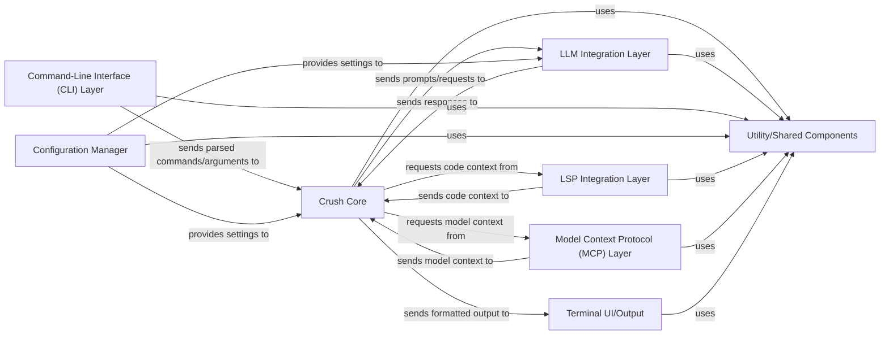

## Details

Architectural analysis of a CLI-based AI/ML developer tool, identifying key components and their interactions, focusing on modularity, extensibility, and core functionalities.

### Crush Core
The central orchestrator of the application, managing sessions, context, and coordinating interactions between different components. It processes user commands, interacts with LLMs, LSPs, and MCPs, and prepares output.

**Related Classes/Methods**:

- `app/core.go` (1:1)
- `app/session.go` (1:1)
- `app/context.go` (1:1)

### Command-Line Interface (CLI) Layer
Handles parsing command-line arguments, subcommands, and user input. It validates input and delegates execution to the `Crush Core`.

**Related Classes/Methods**:

- `cmd/root.go` (1:1)
- `cmd/commands.go` (1:1)
- `cmd/parser.go` (1:1)

### Configuration Manager
Responsible for loading, merging, and validating configuration from various sources (e.g., local files, global settings, environment variables). It provides a centralized access point for all application and component-specific settings, including sensitive API keys.

**Related Classes/Methods**:

- `config/manager.go` (1:1)
- `config/loader.go` (1:1)
- `config/validator.go` (1:1)

### LLM Integration Layer [[Expand]](./LLM_Integration_Layer.md)
This layer provides a unified and abstract interface for interacting with various Large Language Model (LLM) providers. Its core responsibilities include managing API calls, handling request and response formatting, and abstracting provider-specific complexities (e.g., different API endpoints, authentication methods, model-specific parameters). It securely utilizes LLM-specific configuration, such as API keys, retrieved from the `Configuration Manager`. Designed for extensibility, this component facilitates the easy integration of new LLM backends without impacting the core application logic, aligning with the project's modular and AI/ML-powered developer tool nature.

**Related Classes/Methods**:

- `llm/interface.go` (1:1)
- `llm/openai.go` (1:1)
- `llm/gemini.go` (1:1)
- `llm/adapters.go` (1:1)
- `llm/formatter.go` (1:1)
- `llm/client.go` (1:1)

### LSP Integration Layer [[Expand]](./LSP_Integration_Layer.md)
Manages Language Server Protocol (LSP) client connections. It sends requests to LSP servers to gather code context and processes their responses, providing structured code information to the `Crush Core`.

**Related Classes/Methods**:

- `lsp/client.go` (1:1)
- `lsp/protocol.go` (1:1)
- `lsp/handlers.go` (1:1)

### Model Context Protocol (MCP) Layer [[Expand]](./Model_Context_Protocol_MCP_Layer.md)
Manages interactions with Model Context Protocol (MCP) servers. It supports different transport types (stdio, http, sse) for data exchange, enabling the application to receive and send model-specific context and data.

**Related Classes/Methods**:

- `mcp/server.go` (1:1)
- `mcp/protocol.go` (1:1)
- `mcp/transports.go` (1:1)

### Terminal UI/Output [[Expand]](./Terminal_UI_Output.md)
Responsible for rendering all application output to the terminal. It ensures a consistent, user-friendly, and responsive experience, handling formatting, colors, and interactive elements.

**Related Classes/Methods**:

- `ui/renderer.go` (1:1)
- `ui/styles.go` (1:1)
- `ui/display.go` (1:1)

### Utility/Shared Components
A collection of common functionalities and data structures used across multiple components, such as logging, error handling, and data validation. This component promotes code reuse and maintains a clear separation of concerns.

**Related Classes/Methods**:

- `util/logger.go` (1:1)
- `util/errors.go` (1:1)
- `util/models.go` (1:1)

### [FAQ](https://github.com/CodeBoarding/GeneratedOnBoardings/tree/main?tab=readme-ov-file#faq)