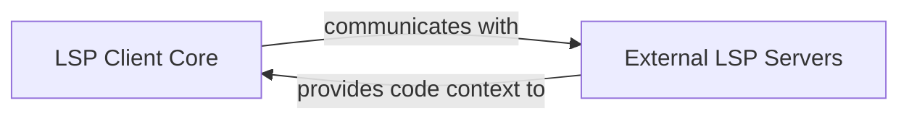

## Details

Revised analysis of a Go-based LSP client project, focusing on core LSP integration and interaction with external LSP servers, correcting previous assumptions about project language and component identification.

### LSP Client Core
This component is responsible for establishing and managing connections with external Language Server Protocol (LSP) servers. It handles sending various LSP requests (e.g., for document symbols, definitions, references, diagnostics) and processing the responses. This component acts as the primary interface for interacting with LSP servers to retrieve code-related information.

**Related Classes/Methods**:

- `internal/app/lsp.go` (1:1)

### External LSP Servers
These are independent, external Language Server Protocol (LSP) servers (e.g., `gopls` for Go, `pyright` for Python) that run as separate processes. They provide detailed code-related information (e.g., definitions, references, diagnostics) to the `LSP Client Core` upon request. These servers are external to this project's codebase.

**Related Classes/Methods**: _None_

### [FAQ](https://github.com/CodeBoarding/GeneratedOnBoardings/tree/main?tab=readme-ov-file#faq)