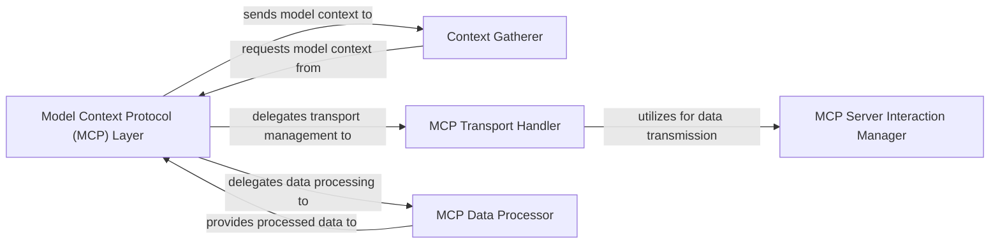

## Details

One paragraph explaining the functionality which is represented by this graph. What the main flow is and what is its purpose.

### Model Context Protocol (MCP) Layer [[Expand]](./Model_Context_Protocol_MCP_Layer.md)
The primary interface and orchestrator for the MCP subsystem. It manages overall interactions with MCP servers, delegates to specific transport handlers, and coordinates data serialization/deserialization for context exchange.

**Related Classes/Methods**: _None_

### Context Gatherer
An external component responsible for initiating requests for model-specific context data and receiving the retrieved context from the `Model Context Protocol (MCP) Layer`. It acts as the primary client of the MCP subsystem.

**Related Classes/Methods**: _None_

### MCP Transport Handler
Manages the specifics of different communication transport types (e.g., stdio, HTTP, SSE) used for interacting with MCP servers. It abstracts the underlying communication mechanism, allowing the MCP Layer to remain agnostic to the transport details.

**Related Classes/Methods**: _None_

### MCP Server Interaction Manager
Handles the low-level communication and connection management with external MCP servers over the chosen transport. It is responsible for the direct sending and receiving of raw data streams.

**Related Classes/Methods**: _None_

### MCP Data Processor
Responsible for the serialization (converting data to a transmittable format) and deserialization (converting received data back to an usable format) of model context data. It ensures proper formatting for exchange with MCP servers and internal application use.

**Related Classes/Methods**: _None_

### [FAQ](https://github.com/CodeBoarding/GeneratedOnBoardings/tree/main?tab=readme-ov-file#faq)