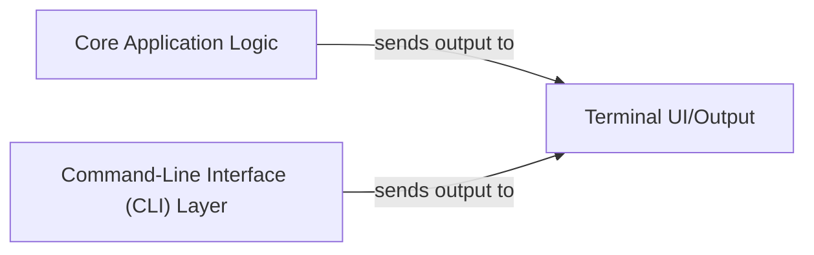

## Details

One paragraph explaining the functionality which is represented by this graph. What the main flow is and what is its purpose.

### Core Application Logic [[Expand]](./Core_Application_Logic.md)
Encapsulates the primary business logic and core functionalities of the application. This component is responsible for processing data, executing commands, and managing the overall application state, acting as the central orchestrator for the system's operations.

**Related Classes/Methods**: _None_

### Command-Line Interface (CLI) Layer
Manages user interaction through the command line. This component is responsible for parsing user commands, validating input, and dispatching requests to the `Core Application Logic`. It also handles the presentation of information back to the user, often by interacting with the `Terminal UI/Output` component.

**Related Classes/Methods**: _None_

### Terminal UI/Output [[Expand]](./Terminal_UI_Output.md)
Dedicated to rendering all application output to the terminal, ensuring a consistent, user-friendly, and responsive experience. This component is responsible for formatting and displaying various application messages, results, and interactive elements to the user.

**Related Classes/Methods**:

- `internal/ansiext/ansi.go` (1:1)

### [FAQ](https://github.com/CodeBoarding/GeneratedOnBoardings/tree/main?tab=readme-ov-file#faq)