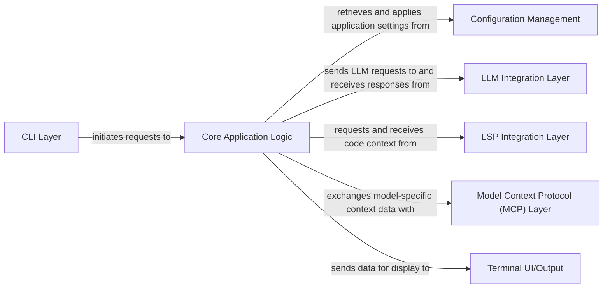

## Details

Analysis of a Go project, mapping conceptual components to likely Go directories/files. Due to the project being Go and available tools being Python-specific, direct source code retrieval and precise line-number references are not possible. Source paths are inferred based on common Go project structures.

### CLI Layer [[Expand]](./CLI_Layer.md)
Serves as the primary user interface, responsible for parsing command-line arguments, subcommands, and user input, translating them into actionable requests.

**Related Classes/Methods**:

- `internal/cmd/root.go` (1:1)
- `internal/cmd/run.go` (1:1)
- `internal/cmd/logs.go` (1:1)
- `internal/cmd/schema.go` (1:1)

### Core Application Logic [[Expand]](./Core_Application_Logic.md)
The central orchestrator, managing sessions, maintaining context, and coordinating interactions between all other components. It processes user requests and directs them to appropriate backend services.

**Related Classes/Methods**:

- `internal/app/app.go` (1:1)
- `internal/app/lsp.go` (1:1)

### Configuration Management [[Expand]](./Configuration_Management.md)
Handles the loading, merging, and validation of application configurations from various sources, ensuring the application operates with correct parameters.

**Related Classes/Methods**:

- `internal/config/config.go` (1:1)
- `internal/config/load.go` (1:1)
- `internal/config/merge.go` (1:1)

### LLM Integration Layer [[Expand]](./LLM_Integration_Layer.md)
Provides an abstract interface for interacting with various Large Language Model (LLM) providers, managing API calls, request/response formatting, and abstracting provider-specific complexities.

**Related Classes/Methods**: _None_

### LSP Integration Layer [[Expand]](./LSP_Integration_Layer.md)
Manages client connections to Language Server Protocol (LSP) servers, sending requests and processing responses to gather code context.

**Related Classes/Methods**:

- `internal/app/lsp.go` (1:1)

### Model Context Protocol (MCP) Layer [[Expand]](./Model_Context_Protocol_MCP_Layer.md)
Manages interactions with Model Context Protocol (MCP) servers, supporting different transport types and facilitating the exchange of model-specific context data.

**Related Classes/Methods**: _None_

### Terminal UI/Output [[Expand]](./Terminal_UI_Output.md)
Dedicated to rendering all application output to the terminal, ensuring a consistent, user-friendly, and responsive experience.

**Related Classes/Methods**:

- `internal/ansiext/ansi.go` (1:1)

### [FAQ](https://github.com/CodeBoarding/GeneratedOnBoardings/tree/main?tab=readme-ov-file#faq)