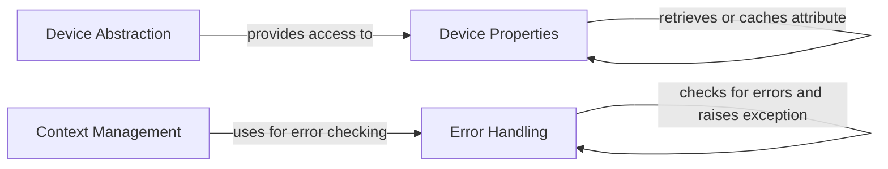

## Component Details

The CUDA API Interface component provides a set of utilities and classes for interacting with the CUDA Driver and Runtime APIs. It focuses on error handling, device context management, and exposing device properties. The core functionality revolves around checking for errors from CUDA API calls, retrieving device information, and providing a consistent interface for higher-level abstractions to interact with CUDA devices.

### Error Handling
This component is responsible for checking and handling errors returned by the CUDA Driver and Runtime APIs. It provides functions to check for errors, and raise appropriate exceptions (CUDAError, NVRTCError) when an error is detected. This ensures that CUDA operations are executed correctly and that errors are properly reported to the user.
- **Related Classes/Methods**: `cuda-python.cuda_core.cuda.core.experimental._utils.cuda_utils:_check_driver_error`, `cuda-python.cuda_core.cuda.core.experimental._utils.cuda_utils:_check_runtime_error`, `cuda-python.cuda_core.cuda.core.experimental._utils.cuda_utils:_check_error`, `cuda-python.cuda_core.cuda.core.experimental._utils.cuda_utils:handle_return`, `cuda-python.cuda_core.cuda.core.experimental._utils.cuda_utils:CUDAError`, `cuda-python.cuda_core.cuda.core.experimental._utils.cuda_utils:NVRTCError`

### Device Properties
This component provides access to various properties of a CUDA device. It uses caching to improve performance and retrieves properties from the CUDA API when they are not cached. The properties include maximum thread counts, block dimensions, grid dimensions, shared memory size, and warp size. The `DeviceProperties` class encapsulates these properties and provides a convenient way to query them.
- **Related Classes/Methods**: `cuda-python.cuda_core.cuda.core.experimental._device.DeviceProperties:_init_`, `cuda-python.cuda_core.cuda.core.experimental._device.DeviceProperties:_get_cached_attribute`, `cuda-python.cuda_core.cuda.core.experimental._device.DeviceProperties:_get_attribute`, `cuda-python.cuda_core.cuda.core.experimental._device.DeviceProperties:max_threads_per_block`, `cuda-python.cuda_core.cuda.core.experimental._device.DeviceProperties:max_block_dim_x`, `cuda-python.cuda_core.cuda.core.experimental._device.DeviceProperties:max_block_dim_y`, `cuda-python.cuda_core.cuda.core.experimental._device.DeviceProperties:max_block_dim_z`, `cuda-python.cuda_core.cuda.core.experimental._device.DeviceProperties:max_grid_dim_x`, `cuda-python.cuda_core.cuda.core.experimental._device.DeviceProperties:max_grid_dim_y`, `cuda-python.cuda_core.cuda.core.experimental._device.DeviceProperties:max_grid_dim_z`

### Device Abstraction
This component represents a CUDA device and provides access to its properties. The `Device` class has a `properties` attribute, which is an instance of the `DeviceProperties` class. This allows users to easily access device properties through the `Device` object.
- **Related Classes/Methods**: `cuda-python.cuda_core.cuda.core.experimental._device.Device:properties`

### Context Management
This component manages the CUDA context and provides a function to retrieve the device associated with the current context. The `get_device_from_ctx` function retrieves the device and handles any errors that may occur during the process.
- **Related Classes/Methods**: `cuda-python.cuda_core.cuda.core.experimental._utils.cuda_utils:get_device_from_ctx`
