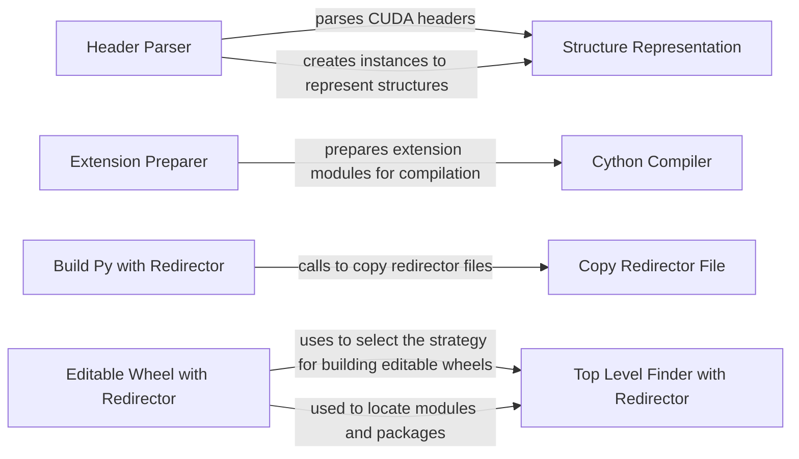

## Component Details

The CUDA Bindings Manager is responsible for generating Python bindings for CUDA, enabling Python code to interact with CUDA functionalities. It involves parsing CUDA headers, preparing extension modules, and building the Python package with necessary redirectors for handling dynamic linking of CUDA libraries. The process ensures seamless integration of CUDA runtime with Python, allowing developers to leverage CUDA's parallel computing capabilities from Python.

### Header Parser
The Header Parser component parses CUDA headers to extract information about structures, enums, functions, and other data types. It uses `pyclibrary.CParser` to analyze the headers and identify relevant information needed for generating Python bindings.
- **Related Classes/Methods**: `cuda-python.cuda_bindings.setup:parse_headers`

### Structure Representation
The Structure Representation component represents structures and unions defined in CUDA headers. It stores information about the structure's members and their types, which is used to generate corresponding Python classes or data structures. It provides methods for recursively discovering members of nested structures.
- **Related Classes/Methods**: `cuda-python.cuda_bindings.setup.Struct`

### Extension Preparer
The Extension Preparer component prepares extension modules for Cython compilation. It takes a list of source files and libraries, and creates `setuptools.Extension` objects. It handles platform-specific file renaming and sets up include directories, library directories, and extra compile arguments.
- **Related Classes/Methods**: `cuda-python.cuda_bindings.setup:prep_extensions`

### Cython Compiler
The Cython Compiler component compiles the extension modules using `Cython.Build.cythonize`. It takes a list of `setuptools.Extension` objects and compiles them into C or C++ source files. It also sets compiler directives and handles parallel compilation.
- **Related Classes/Methods**: `cuda-python.cuda_bindings.setup:do_cythonize`

### Build Py with Redirector
The Build Py with Redirector component is a custom `build_py` command that includes the redirector files (`_cuda_bindings_redirector.pth` and `_cuda_bindings_redirector.py`) in the generated package. This is crucial for handling dynamic linking or loading of CUDA libraries.
- **Related Classes/Methods**: `cuda-python.cuda_bindings.setup.build_py_with_redirector`

### Editable Wheel with Redirector
The Editable Wheel with Redirector component is a custom `editable_wheel` command that selects the appropriate strategy for building editable wheels, incorporating the redirector. Editable wheels allow developers to make changes to the package's source code and have those changes reflected immediately without reinstalling the package.
- **Related Classes/Methods**: `cuda-python.cuda_bindings.setup.editable_wheel_with_redirector`

### Top Level Finder with Redirector
The Top Level Finder with Redirector component is a custom finder that incorporates the redirector mechanism. This finder is used to locate modules and packages within the `cuda-python` package, ensuring that the redirector is used when loading CUDA libraries.
- **Related Classes/Methods**: `cuda-python.cuda_bindings.setup.TopLevelFinderWithRedirector`

### Copy Redirector File
The Copy Redirector File component copies the redirector file to the appropriate location during the build process. This ensures that the redirector mechanism is available when the package is installed and used.
- **Related Classes/Methods**: `cuda-python.cuda_bindings.setup.build_py_with_redirector.copy_redirector_file`
