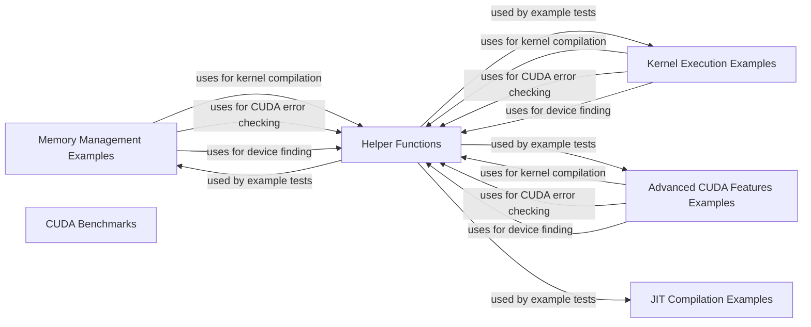

## Component Details

The CUDA Examples & Benchmarks component provides a suite of example codes and benchmarks designed to showcase various CUDA features, techniques, and performance evaluation methods. These examples cover a wide range of CUDA functionalities, from basic memory management and kernel execution to advanced features like CUDA graphs, asynchronous memory copies, and JIT compilation. The benchmarks help developers assess the performance of CUDA operations, providing insights into optimization strategies. This component serves as a valuable resource for both learning and testing CUDA capabilities within the cuda-python framework.

### Memory Management Examples
This component demonstrates memory management techniques in CUDA, including memory mapping (MMAP) across multiple devices. It showcases how to allocate and free memory using the CUDA Driver API, enabling efficient data transfer and processing across multiple GPUs.
- **Related Classes/Methods**: `cuda-python.cuda_bindings.examples.0_Introduction.vectorAddMMAP_test`

### Kernel Execution Examples
This component provides examples of kernel execution in CUDA, including testing clock functionality using NVRTC (CUDA Runtime Compilation). It demonstrates how to compile and launch CUDA kernels, measure execution time, and perform system-wide atomic operations.
- **Related Classes/Methods**: `cuda-python.cuda_bindings.examples.0_Introduction.clock_nvrtc_test`, `cuda-python.cuda_bindings.examples.0_Introduction.systemWideAtomics_test`

### Advanced CUDA Features Examples
This component showcases advanced CUDA features such as cubemap textures, conjugate gradient algorithms, stream-ordered allocation, and CUDA graphs. It provides practical examples of how to use these features to solve complex problems and optimize CUDA applications.
- **Related Classes/Methods**: `cuda-python.cuda_bindings.examples.0_Introduction.simpleCubemapTexture_test`, `cuda-python.cuda_bindings.examples.4_CUDA_Libraries.conjugateGradientMultiBlockCG_test`, `cuda-python.cuda_bindings.examples.2_Concepts_and_Techniques.streamOrderedAllocation_test`, `cuda-python.cuda_bindings.examples.3_CUDA_Features.simpleCudaGraphs_test`, `cuda-python.cuda_bindings.examples.3_CUDA_Features.globalToShmemAsyncCopy_test`

### JIT Compilation Examples
This component demonstrates the use of JIT (Just-In-Time) compilation in CUDA, allowing for dynamic compilation of CUDA code at runtime. It includes examples of compiling and launching simple kernels, as well as more complex examples involving LTO (Link-Time Optimization) for fractal calculations.
- **Related Classes/Methods**: `cuda-python.cuda_bindings.examples.extra.jit_program_test`, `cuda-python.cuda_core.examples.jit_lto_fractal`

### CUDA Benchmarks
This component provides benchmarks for evaluating the performance of CUDA operations, such as kernel launch latency. It includes tools for initializing CUDA, loading modules, and measuring the execution time of different kernels.
- **Related Classes/Methods**: `cuda-python.cuda_bindings.benchmarks.test_launch_latency`, `cuda-python.cuda_bindings.benchmarks.conftest`

### Helper Functions
This component provides helper functions for working with CUDA, including kernel compilation, error checking, and device finding. These functions simplify common CUDA operations and improve code readability.
- **Related Classes/Methods**: `cuda-python.cuda_bindings.examples.common.common.KernelHelper`, `cuda-python.cuda_bindings.examples.common.helper_cuda`
