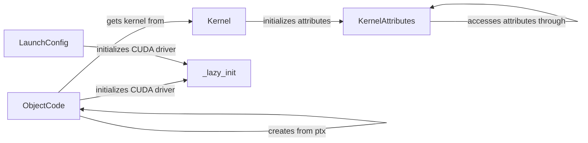

## Component Details

The CUDA Kernel Management subsystem is responsible for loading, managing, and launching CUDA kernels. It handles the compilation of CUDA code (PTX or Cubin), extracts kernel information, and configures the kernel execution environment. The core functionality includes managing kernel attributes, setting up launch configurations, and lazily initializing the CUDA driver. This system enables developers to execute CUDA code on the GPU by providing tools to define and manage kernel execution parameters.

### KernelAttributes
This class caches and provides access to CUDA kernel attributes like maximum threads per block, shared memory size, register count, and PTX/binary versions. It optimizes attribute retrieval by caching values to avoid redundant queries to the CUDA driver.
- **Related Classes/Methods**: `cuda-python.cuda_core.cuda.core.experimental._module.KernelAttributes`

### Kernel
This class represents a CUDA kernel and provides access to its attributes and argument information. It retrieves information about the kernel's arguments (number and type) and associates the kernel with its attributes (obtained from `KernelAttributes`).
- **Related Classes/Methods**: `cuda-python.cuda_core.cuda.core.experimental._module.Kernel`

### ObjectCode
This class represents the compiled CUDA code (either PTX or Cubin). It loads the code from a file or string, extracts the kernels defined within it, and handles the lazy initialization of the CUDA driver.
- **Related Classes/Methods**: `cuda-python.cuda_core.cuda.core.experimental._module.ObjectCode`

### LaunchConfig
This class encapsulates the configuration for launching a CUDA kernel, including the grid and block dimensions. It initializes the launch configuration and ensures that the CUDA driver is initialized.
- **Related Classes/Methods**: `cuda-python.cuda_core.cuda.core.experimental._launcher.LaunchConfig`

### _lazy_init
This function lazily initializes the CUDA driver. It is called by `ObjectCode` and `LaunchConfig` to ensure that the driver is initialized before any CUDA operations are performed.
- **Related Classes/Methods**: `cuda-python.cuda_core.cuda.core.experimental._module._lazy_init`, `cuda-python.cuda_core.cuda.core.experimental._launcher._lazy_init`
