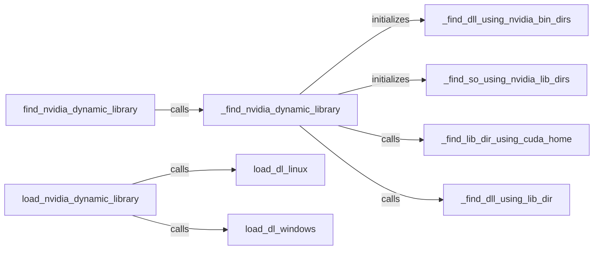

## Component Details

The CUDA Library Loader is responsible for dynamically locating and loading NVIDIA CUDA dynamic libraries, ensuring that the necessary CUDA libraries are available at runtime. It searches for libraries in various locations, including system paths, CUDA installation directories, and directories specified by environment variables. The loader handles different operating systems and CUDA installation configurations to provide a consistent and reliable way to access CUDA functionalities.

### find_nvidia_dynamic_library
This component serves as the main entry point for locating NVIDIA dynamic libraries. It orchestrates the search process by calling helper functions that look in different locations and using different strategies. It also handles retries with different priorities to ensure the library is found.
- **Related Classes/Methods**: `cuda_bindings.cuda.bindings._path_finder.find_nvidia_dynamic_library.find_nvidia_dynamic_library`

### _find_nvidia_dynamic_library
This component encapsulates the logic for finding NVIDIA dynamic libraries, including initializing search paths and defining retry strategies. It calls different methods to find libraries in different locations based on the system's configuration and environment variables.
- **Related Classes/Methods**: `cuda_bindings.cuda.bindings._path_finder.find_nvidia_dynamic_library._find_nvidia_dynamic_library`

### _find_dll_using_nvidia_bin_dirs
This component searches for DLLs within directories specified by NVIDIA's binary directory conventions, typically found within CUDA installation directories. It iterates through the specified directories and attempts to locate the required DLL files.
- **Related Classes/Methods**: `cuda_bindings.cuda.bindings._path_finder.find_nvidia_dynamic_library._find_dll_using_nvidia_bin_dirs`

### _find_so_using_nvidia_lib_dirs
This component searches for shared objects (SOs) within directories specified by NVIDIA's library directory conventions, commonly found within CUDA installation directories. It focuses on locating the necessary SO files for Linux systems.
- **Related Classes/Methods**: `cuda_bindings.cuda.bindings._path_finder.find_nvidia_dynamic_library._find_so_using_nvidia_lib_dirs`

### _find_lib_dir_using_cuda_home
This component attempts to locate library directories using the CUDA_HOME environment variable. It retrieves the value of CUDA_HOME and constructs potential library paths based on this variable.
- **Related Classes/Methods**: `cuda_bindings.cuda.bindings._path_finder.find_nvidia_dynamic_library._find_lib_dir_using_cuda_home`

### _find_dll_using_lib_dir
This component searches for DLLs within a specified library directory. It takes a library directory as input and attempts to locate the required DLL files within that directory.
- **Related Classes/Methods**: `cuda_bindings.cuda.bindings._path_finder.find_nvidia_dynamic_library._find_dll_using_lib_dir`

### load_nvidia_dynamic_library
This component serves as the entry point for loading NVIDIA dynamic libraries. It orchestrates the loading process by calling helper functions that handle caching and the actual loading of the library.
- **Related Classes/Methods**: `cuda_bindings.cuda.bindings._path_finder.load_nvidia_dynamic_library.load_nvidia_dynamic_library`

### load_dl_linux
This component is responsible for loading dynamic libraries on Linux systems. It contains functions to check if a library is already loaded and to load it using system search paths or absolute paths.
- **Related Classes/Methods**: `cuda_bindings.cuda.bindings._path_finder.load_dl_linux.py`

### load_dl_windows
This component is responsible for loading dynamic libraries on Windows systems. It contains functions to check if a library is already loaded and to load it using system search paths or absolute paths.
- **Related Classes/Methods**: `cuda_bindings.cuda.bindings._path_finder.load_dl_windows.py`
