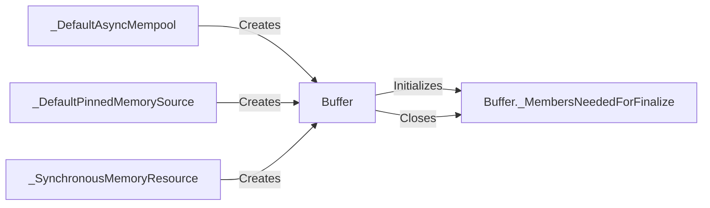

## Component Details

The CUDA Memory Manager provides a set of classes and functions for allocating and managing memory on CUDA devices. It offers different memory resources, including asynchronous memory pools, pinned memory, and synchronous memory, to optimize memory usage and data transfer between the host and device. The core component is the `Buffer` class, which represents a memory buffer on the GPU and interacts with the memory resources to allocate and deallocate memory. The memory resources, such as `_DefaultAsyncMempool`, `_DefaultPinnedMemorySource`, and `_SynchronousMemoryResource`, handle the actual memory allocation using CUDA's API. The `Buffer._MembersNeededForFinalize` class ensures proper memory release when a `Buffer` object is no longer needed.

### Buffer
Represents a memory buffer allocated on the GPU. It provides an interface for interacting with the allocated memory and handles the finalization of the buffer when it's no longer needed. It relies on `Buffer._MembersNeededForFinalize` to manage the resources needed for finalization.
- **Related Classes/Methods**: `cuda-python.cuda_core.cuda.core.experimental._memory.Buffer`, `cuda-python.cuda_core.cuda.core.experimental._memory.Buffer:__init__`, `cuda-python.cuda_core.cuda.core.experimental._memory.Buffer:close`

### _DefaultAsyncMempool
A memory resource that uses an asynchronous memory pool for allocation. It's responsible for allocating memory blocks from the pool and creating Buffer objects that wrap these blocks. It interacts with CUDA's memory pool API to perform asynchronous memory allocations.
- **Related Classes/Methods**: `cuda-python.cuda_core.cuda.core.experimental._memory._DefaultAsyncMempool`, `cuda-python.cuda_core.cuda.core.experimental._memory._DefaultAsyncMempool:allocate`

### _DefaultPinnedMemorySource
A memory resource that allocates pinned (page-locked) memory. This type of memory is directly accessible by the GPU, avoiding the need for data transfers from system memory. It creates Buffer objects that wrap the allocated pinned memory. It uses CUDA's API to allocate pinned memory.
- **Related Classes/Methods**: `cuda-python.cuda_core.cuda.core.experimental._memory._DefaultPinnedMemorySource`, `cuda-python.cuda_core.cuda.core.experimental._memory._DefaultPinnedMemorySource:allocate`

### _SynchronousMemoryResource
A memory resource that allocates memory synchronously. It creates Buffer objects that wrap the allocated memory. It uses CUDA's API to allocate memory synchronously.
- **Related Classes/Methods**: `cuda-python.cuda_core.cuda.core.experimental._memory._SynchronousMemoryResource`, `cuda-python.cuda_core.cuda.core.experimental._memory._SynchronousMemoryResource:allocate`

### Buffer._MembersNeededForFinalize
A helper class used to store the members needed for finalization of the Buffer object. It ensures that the memory is properly released when the Buffer is no longer in use. It holds references to the memory resource and the allocated memory block.
- **Related Classes/Methods**: `cuda-python.cuda_core.cuda.core.experimental._memory.Buffer._MembersNeededForFinalize`, `cuda-python.cuda_core.cuda.core.experimental._memory.Buffer._MembersNeededForFinalize.close`
