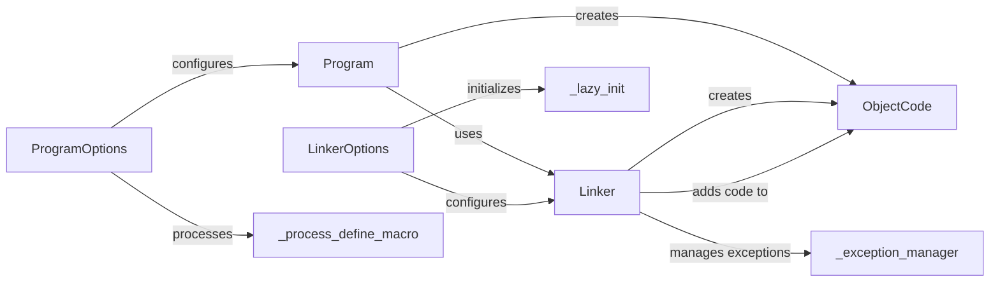

## Component Details

The CUDA Program Manager provides a high-level interface for compiling and linking CUDA code within Python. It encapsulates the complexities of using NVRTC or the CUDA driver's compilation and linking APIs, offering a simplified workflow for building and deploying CUDA applications. The core components include `Program` for managing compilation units, `ProgramOptions` and `LinkerOptions` for configuring the compilation and linking processes, `Linker` for linking object codes, and `ObjectCode` for representing compiled code. The `_process_define_macro` and `_lazy_init` functions handle macro processing and linker initialization, respectively. The `_exception_manager` context manager improves error handling during linking.

### Program
The `Program` class represents a compilation unit. It manages the compilation of CUDA code (C++ or PTX) using NVRTC or a `Linker`, producing object code. It provides a unified interface to multiple underlying compiler libraries.
- **Related Classes/Methods**: `cuda-python.cuda_core.cuda.core.experimental._program.Program`

### ProgramOptions
The `ProgramOptions` dataclass encapsulates compilation options for the NVRTC compiler or the linker, controlling aspects like architecture, optimization level, debug information, and macro definitions.
- **Related Classes/Methods**: `cuda-python.cuda_core.cuda.core.experimental._program.ProgramOptions`

### Linker
The `Linker` class links multiple object codes into a single object code, using either nvJitLink or the CUDA driver's cuLink APIs. It takes `ObjectCode` objects and `LinkerOptions` as input and produces a linked `ObjectCode` as output.
- **Related Classes/Methods**: `cuda-python.cuda_core.cuda.core.experimental._linker.Linker`

### LinkerOptions
The `LinkerOptions` dataclass encapsulates linking options for the linker, controlling aspects like architecture, optimization level, debug information, and library paths. The available options depend on whether nvJitLink or the CUDA driver's cuLink APIs are used.
- **Related Classes/Methods**: `cuda-python.cuda_core.cuda.core.experimental._linker.LinkerOptions`

### ObjectCode
The `ObjectCode` class represents compiled code (PTX, cubin, or LTOIR). It's the output of the compilation and linking process and can be loaded into a CUDA module.
- **Related Classes/Methods**: `cuda-python.cuda_core.cuda.core.experimental._module.ObjectCode`

### _process_define_macro
The `_process_define_macro` function handles the processing of define macro options for the compiler, formatting macro definitions into a string format suitable for passing to the compiler.
- **Related Classes/Methods**: `cuda-python.cuda_core.cuda.core.experimental._program._process_define_macro`

### _lazy_init
The `_lazy_init` function in the `_linker` module initializes the linking backend (nvJitLink or CUDA driver's cuLink) and determines which API to use for linking.
- **Related Classes/Methods**: `cuda-python.cuda_core.cuda.core.experimental._linker._lazy_init`

### _exception_manager
The `_exception_manager` context manager in the `_linker` module improves the error messages of exceptions raised by the linker backend by adding the linker error log to the exception message.
- **Related Classes/Methods**: `cuda-python.cuda_core.cuda.core.experimental._linker._exception_manager`
