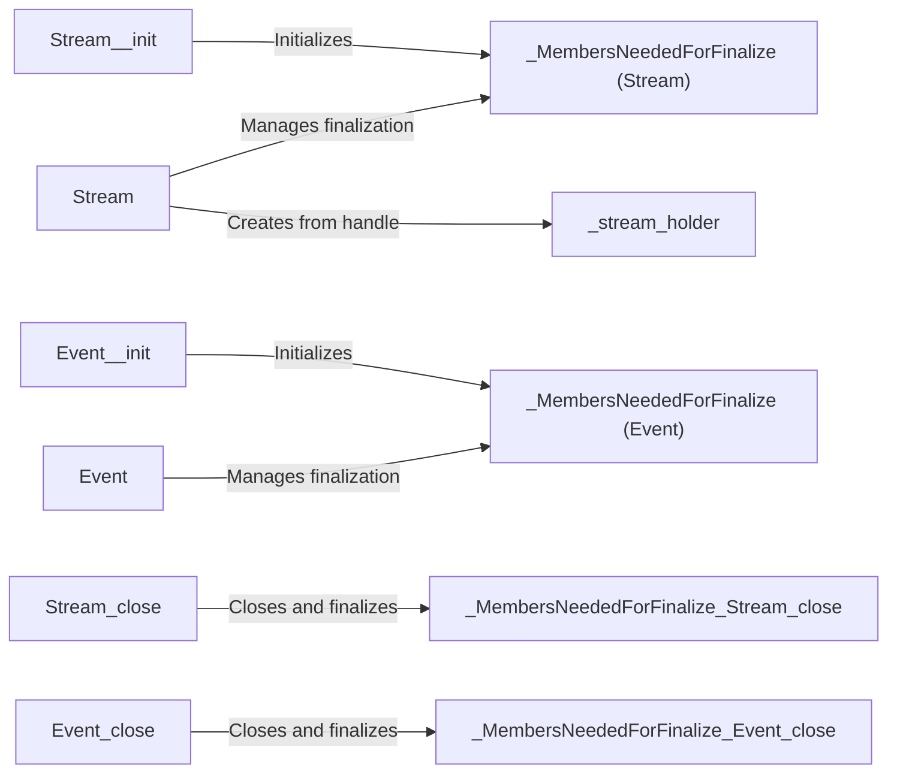

## Component Details

The CUDA Stream & Event Handler component provides mechanisms for managing asynchronous operations on NVIDIA GPUs. It enables concurrent execution of kernels and memory transfers through the use of CUDA streams, and it facilitates synchronization between different streams or between the host and device using CUDA events. This allows for overlapping computation and data transfer, leading to improved performance in CUDA applications. The core functionality revolves around the `Stream` and `Event` classes, which encapsulate the CUDA stream and event concepts, respectively. These classes provide methods for creating, managing, and synchronizing asynchronous operations.

### Stream
The `Stream` class represents a CUDA stream, which is a sequence of asynchronous operations that execute in order on the GPU. It allows for concurrent execution of kernels and memory transfers, improving overall performance. The stream manages the execution order of CUDA operations, enabling overlapping computation and data transfer.
- **Related Classes/Methods**: `cuda-python.cuda_core.cuda.core.experimental._stream.Stream`, `cuda-python.cuda_core.cuda.core.experimental._stream.Stream:_legacy_default`, `cuda-python.cuda_core.cuda.core.experimental._stream.Stream:_per_thread_default`, `cuda-python.cuda_core.cuda.core.experimental._stream.Stream:_init`, `cuda-python.cuda_core.cuda.core.experimental._stream.Stream:close`, `cuda-python.cuda_core.cuda.core.experimental._stream.Stream:wait`, `cuda-python.cuda_core.cuda.core.experimental._stream.Stream:from_handle`

### Event
The `Event` class represents a CUDA event, which is a synchronization point in a CUDA stream. It allows tracking the progress of asynchronous operations on the GPU. Events can be used to measure the execution time of kernels or to synchronize different streams, ensuring that operations complete in the correct order.
- **Related Classes/Methods**: `cuda-python.cuda_core.cuda.core.experimental._event.Event`, `cuda-python.cuda_core.cuda.core.experimental._event.Event:_init`, `cuda-python.cuda_core.cuda.core.experimental._event.Event:close`

### _MembersNeededForFinalize (Stream)
This class is responsible for holding the members of the `Stream` class that are needed for finalization. It ensures that resources associated with a CUDA stream are properly released when the `Stream` object is no longer in use, preventing memory leaks and ensuring proper cleanup.
- **Related Classes/Methods**: `cuda-python.cuda_core.cuda.core.experimental._stream.Stream._MembersNeededForFinalize`

### _MembersNeededForFinalize (Event)
This class is responsible for holding the members of the `Event` class that are needed for finalization. It ensures that resources associated with a CUDA event are properly released when the `Event` object is no longer in use, preventing resource leaks and ensuring proper cleanup.
- **Related Classes/Methods**: `cuda-python.cuda_core.cuda.core.experimental._event.Event._MembersNeededForFinalize`

### _stream_holder
This component manages the underlying CUDA stream handle when creating a `Stream` from an existing handle. It ensures proper ownership and lifetime management of the CUDA stream, preventing issues such as double-freeing or use-after-free errors.
- **Related Classes/Methods**: `cuda-python.cuda_core.cuda.core.experimental._stream.Stream.from_handle._stream_holder`
