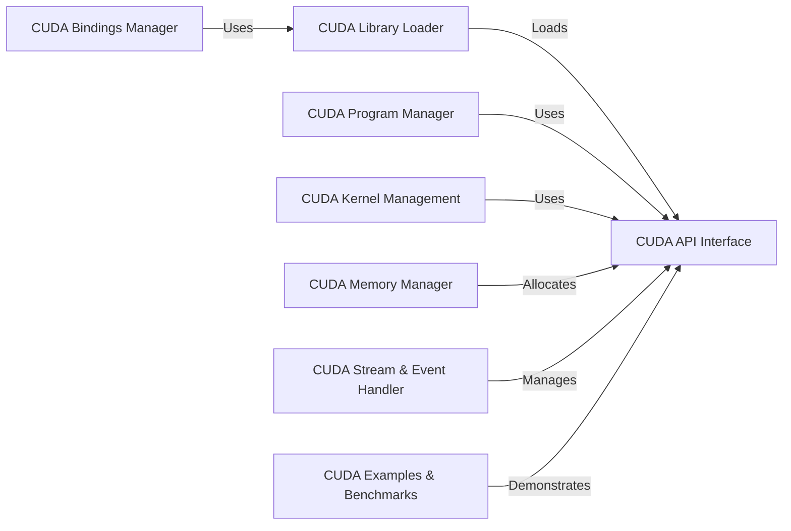

## Component Details

The cuda-python project provides Python bindings for the NVIDIA CUDA platform, enabling developers to leverage the power of GPUs for accelerated computing. The project encompasses functionalities for setting up the bindings, loading CUDA libraries, managing CUDA programs and kernels, handling memory allocation, and enabling asynchronous execution through streams and events. It offers both low-level access to the CUDA Driver API and a higher-level interface to the CUDA Runtime API, catering to a wide range of CUDA programming tasks.

### CUDA Bindings Manager
This component is responsible for setting up and building the CUDA Python bindings. It involves parsing CUDA headers, copying necessary files, and building the Python extension modules that provide access to the CUDA API. It ensures that the CUDA runtime environment is correctly integrated with Python, allowing seamless interaction between Python code and CUDA functionalities.
- **Related Classes/Methods**: `cuda-python.cuda_bindings.setup:parse_headers`, `cuda-python.cuda_bindings.setup.build_py_with_redirector:run`, `cuda-python.cuda_bindings.setup.editable_wheel_with_redirector:_select_strategy`

### CUDA Library Loader
The CUDA Library Loader dynamically locates and loads NVIDIA CUDA dynamic libraries. It handles different operating systems and CUDA installation configurations to ensure that the necessary CUDA libraries are available at runtime. This component is crucial for enabling the Python bindings to interact with the CUDA driver and runtime, providing a consistent and reliable way to access CUDA functionalities across different environments.
- **Related Classes/Methods**: `cuda_bindings.cuda.bindings._path_finder.load_dl_windows:check_if_already_loaded_from_elsewhere`, `cuda_bindings.cuda.bindings._path_finder.load_dl_windows:load_with_system_search`, `cuda_bindings.cuda.bindings._path_finder.load_dl_windows:load_with_abs_path`, `cuda_bindings.cuda.bindings._path_finder.find_sub_dirs:find_sub_dirs_cached`, `cuda_bindings.cuda.bindings._path_finder.find_sub_dirs:find_sub_dirs`, `cuda_bindings.cuda.bindings._path_finder.find_sub_dirs:find_sub_dirs_sys_path`, `cuda_bindings.cuda.bindings._path_finder.find_sub_dirs:find_sub_dirs_all_sitepackages`, `cuda_bindings.cuda.bindings._path_finder.find_nvidia_dynamic_library:_find_so_using_nvidia_lib_dirs`, `cuda_bindings.cuda.bindings._path_finder.find_nvidia_dynamic_library:_find_dll_using_nvidia_bin_dirs`, `cuda_bindings.cuda.bindings._path_finder.find_nvidia_dynamic_library:_find_lib_dir_using_cuda_home`, `cuda_bindings.cuda.bindings._path_finder.find_nvidia_dynamic_library:_find_dll_using_lib_dir`, `cuda_bindings.cuda.bindings._path_finder.find_nvidia_dynamic_library._find_nvidia_dynamic_library:__init__`, `cuda_bindings.cuda.bindings._path_finder.find_nvidia_dynamic_library._find_nvidia_dynamic_library:retry_with_cuda_home_priority_last`, `cuda_bindings.cuda.bindings._path_finder.find_nvidia_dynamic_library:find_nvidia_dynamic_library`, `cuda_bindings.cuda.bindings._path_finder.load_dl_linux:abs_path_for_dynamic_library`, `cuda_bindings.cuda.bindings._path_finder.load_dl_linux:check_if_already_loaded_from_elsewhere`, `cuda_bindings.cuda.bindings._path_finder.load_dl_linux:load_with_system_search`, `cuda_bindings.cuda.bindings._path_finder.load_nvidia_dynamic_library:load_nvidia_dynamic_library`

### CUDA API Interface
This component provides a unified interface to both the CUDA Driver API and the CUDA Runtime API. It handles error checking, device context management, and exposes device properties. It serves as the foundation for higher-level abstractions, allowing Python code to interact with CUDA devices and resources in a consistent and reliable manner, abstracting away the complexities of the underlying CUDA APIs.
- **Related Classes/Methods**: `cuda-python.cuda_core.cuda.core.experimental._utils.cuda_utils:_check_driver_error`, `cuda-python.cuda_core.cuda.core.experimental._utils.cuda_utils:_check_runtime_error`, `cuda-python.cuda_core.cuda.core.experimental._utils.cuda_utils:_check_error`, `cuda-python.cuda_core.cuda.core.experimental._utils.cuda_utils:handle_return`, `cuda-python.cuda_core.cuda.core.experimental._utils.cuda_utils:get_device_from_ctx`, `cuda-python.cuda_core.cuda.core.experimental._device.Device:properties`, `cuda-python.cuda_core.cuda.core.experimental._device.DeviceProperties:_get_cached_attribute`, `cuda-python.cuda_core.cuda.core.experimental._device.DeviceProperties:max_threads_per_block`, `cuda-python.cuda_core.cuda.core.experimental._device.DeviceProperties:max_block_dim_x`, `cuda-python.cuda_core.cuda.core.experimental._device.DeviceProperties:max_block_dim_y`, `cuda-python.cuda_core.cuda.core.experimental._device.DeviceProperties:max_block_dim_z`, `cuda-python.cuda_core.cuda.core.experimental._device.DeviceProperties:max_grid_dim_x`, `cuda-python.cuda_core.cuda.core.experimental._device.DeviceProperties:max_grid_dim_y`, `cuda-python.cuda_core.cuda.core.experimental._device.DeviceProperties:max_grid_dim_z`, `cuda-python.cuda_core.cuda.core.experimental._device.DeviceProperties:max_shared_memory_per_block`, `cuda-python.cuda_core.cuda.core.experimental._device.DeviceProperties:total_constant_memory`, `cuda-python.cuda_core.cuda.core.experimental._device.DeviceProperties:warp_size`

### CUDA Program Manager
This component manages the creation, compilation, and linking of CUDA programs. It handles program options, compilation artifacts, and the linking of CUDA code objects to create executable CUDA modules. It provides the tools necessary to build and deploy CUDA applications from Python, enabling developers to write and execute custom CUDA code within their Python programs.
- **Related Classes/Methods**: `cuda-python.cuda_core.cuda.core.experimental._program:_process_define_macro`, `cuda-python.cuda_core.cuda.core.experimental._program.ProgramOptions:__post_init__`, `cuda-python.cuda_core.cuda.core.experimental._program.Program:__init__`, `cuda-python.cuda_core.cuda.core.experimental._program.Program:close`, `cuda-python.cuda_core.cuda.core.experimental._program.Program:compile`, `cuda-python.cuda_core.cuda.core.experimental._linker:_lazy_init`, `cuda-python.cuda_core.cuda.core.experimental._linker.LinkerOptions:__post_init__`, `cuda-python.cuda_core.cuda.core.experimental._linker.Linker:__init__`, `cuda-python.cuda_core.cuda.core.experimental._linker.Linker:_add_code_object`, `cuda-python.cuda_core.cuda.core.experimental._linker.Linker:link`, `cuda-python.cuda_core.cuda.core.experimental._linker.Linker:close`

### CUDA Kernel Management
This component focuses on managing CUDA kernels within loaded modules. It provides access to kernel attributes such as maximum threads per block and shared memory size. It also handles the configuration and launching of CUDA kernels, defining the execution grid and block dimensions. This component is essential for executing CUDA code on the GPU, allowing developers to fine-tune kernel execution parameters for optimal performance.
- **Related Classes/Methods**: `cuda-python.cuda_core.cuda.core.experimental._module.KernelAttributes:max_threads_per_block`, `cuda-python.cuda_core.cuda.core.experimental._module.KernelAttributes:shared_size_bytes`, `cuda-python.cuda_core.cuda.core.experimental._module.KernelAttributes:const_size_bytes`, `cuda-python.cuda_core.cuda.core.experimental._module.KernelAttributes:local_size_bytes`, `cuda-python.cuda_core.cuda.core.experimental._module.KernelAttributes:num_regs`, `cuda-python.cuda_core.cuda.core.experimental._module.KernelAttributes:ptx_version`, `cuda-python.cuda_core.cuda.core.experimental._module.KernelAttributes:binary_version`, `cuda-python.cuda_core.cuda.core.experimental._module.Kernel:attributes`, `cuda-python.cuda_core.cuda.core.experimental._module.Kernel:_get_arguments_info`, `cuda-python.cuda_core.cuda.core.experimental._module.Kernel:num_arguments`, `cuda-python.cuda_core.cuda.core.experimental._module.Kernel:arguments_info`, `cuda-python.cuda_core.cuda.core.experimental._module.ObjectCode:_init`, `cuda-python.cuda_core.cuda.core.experimental._module.ObjectCode:from_cubin`, `cuda-python.cuda_core.cuda.core.experimental._module.ObjectCode:from_ptx`, `cuda-python.cuda_core.cuda.core.experimental._module.ObjectCode:get_kernel`, `cuda-python.cuda_core.cuda.core.experimental._launcher.LaunchConfig:__post_init__`

### CUDA Memory Manager
This component provides tools for allocating and managing memory on CUDA devices. It includes functionalities for creating buffers, allocating memory resources, and managing memory pools. It ensures efficient memory usage and data transfer between the host and device, which is crucial for achieving high performance in CUDA applications.
- **Related Classes/Methods**: `cuda-python.cuda_core.cuda.core.experimental._memory.Buffer:__init__`, `cuda-python.cuda_core.cuda.core.experimental._memory.Buffer:close`, `cuda-python.cuda_core.cuda.core.experimental._memory._DefaultAsyncMempool:allocate`, `cuda-python.cuda_core.cuda.core.experimental._memory._DefaultPinnedMemorySource:allocate`, `cuda-python.cuda_core.cuda.core.experimental._memory._SynchronousMemoryResource:allocate`

### CUDA Stream & Event Handler
This component manages CUDA streams and events, enabling asynchronous execution of CUDA operations and synchronization between host and device or between different streams. It allows for overlapping computation and data transfer, improving overall performance and enabling more complex CUDA workflows.
- **Related Classes/Methods**: `cuda-python.cuda_core.cuda.core.experimental._stream.Stream:_legacy_default`, `cuda-python.cuda_core.cuda.core.experimental._stream.Stream:_per_thread_default`, `cuda-python.cuda_core.cuda.core.experimental._stream.Stream:_init`, `cuda-python.cuda_core.cuda.core.experimental._stream.Stream:close`, `cuda-python.cuda_core.cuda.core.experimental._stream.Stream:wait`, `cuda-python.cuda_core.cuda.core.experimental._stream.Stream:from_handle`, `cuda-python.cuda_core.cuda.core.experimental._event.Event:_init`, `cuda-python.cuda_core.cuda.core.experimental._event.Event:close`

### CUDA Examples & Benchmarks
This component provides example code demonstrating various CUDA features and techniques, as well as benchmarks for evaluating the performance of CUDA operations. It serves as a valuable resource for learning and testing CUDA capabilities within the cuda-python framework, helping developers understand how to use the library effectively and optimize their CUDA code.
- **Related Classes/Methods**: `cuda-python.cuda_bindings.examples.0_Introduction.vectorAddMMAP_test:simpleMallocMultiDeviceMmap`, `cuda-python.cuda_bindings.examples.0_Introduction.vectorAddMMAP_test:main`, `cuda-python.cuda_bindings.examples.0_Introduction.clock_nvrtc_test:main`, `cuda-python.cuda_bindings.benchmarks.test_launch_latency:test_launch_latency_small_kernel_2048B`, `cuda-python.cuda_bindings.benchmarks.conftest:init_cuda`, `cuda-python.cuda_bindings.benchmarks.conftest:load_module`