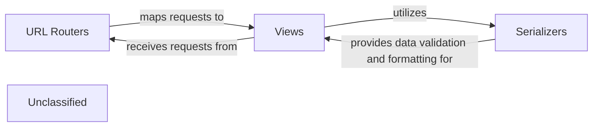

## Details

The `cvimprover-api` project follows a clear architectural pattern, primarily driven by Django's MVT (Model-View-Template) and REST principles. The `URL Routers` component acts as the entry point, directing incoming API requests to the appropriate `Views`. These `Views` encapsulate the core business logic, processing requests, interacting with data models (not explicitly detailed in this subsystem but implied), and orchestrating responses. To ensure data integrity and proper formatting, `Views` heavily rely on `Serializers` for both validating incoming data and transforming outgoing data into a suitable API response format (e.g., JSON). This structured interaction ensures a robust and maintainable API.

### URL Routers
This component defines the public-facing API endpoints and maps incoming HTTP requests to the appropriate view functions or class-based views. `cvimprover.urls` serves as the project's root URL configuration, which then includes `core.urls` for application-specific endpoints, ensuring a structured and modular routing system.

**Related Classes/Methods**:

- <a href="https://github.com/CVImprover/cvimprover-api/blob/maincvimprover/urls.py" target="_blank" rel="noopener noreferrer">`cvimprover.urls`</a>
- <a href="https://github.com/CVImprover/cvimprover-api/blob/maincore/urls.py" target="_blank" rel="noopener noreferrer">`core.urls`</a>

### Views
Views handle the core business logic for each API endpoint. They receive validated data from incoming requests, interact with underlying services or managers to perform necessary operations (e.g., database interactions, calling AI services), and prepare data for the HTTP response. Views act as the interface between the HTTP layer and the application's domain logic.

**Related Classes/Methods**:

- <a href="https://github.com/CVImprover/cvimprover-api/blob/maincore/views.py" target="_blank" rel="noopener noreferrer">`core.views`</a>

### Serializers
This component facilitates data validation and transformation. Serializers convert complex data types (such as Django model instances) into native Python datatypes that can be easily rendered into JSON or XML for API responses. Conversely, they validate and deserialize incoming data from HTTP requests into Python objects suitable for processing by views, ensuring data integrity and adherence to the API contract.

**Related Classes/Methods**:

- <a href="https://github.com/CVImprover/cvimprover-api/blob/maincore/serializers.py" target="_blank" rel="noopener noreferrer">`core.serializers`</a>

### Unclassified
Component for all unclassified files and utility functions (Utility functions/External Libraries/Dependencies)

**Related Classes/Methods**: _None_

### [FAQ](https://github.com/CodeBoarding/GeneratedOnBoardings/tree/main?tab=readme-ov-file#faq)