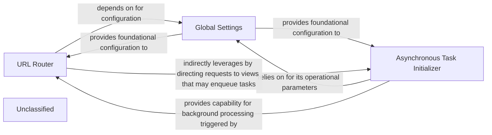

## Details

The `cvimprover` project's architecture is centered around a Django framework, with key components managing request routing, global configurations, and asynchronous task processing. The `URL Router` component, defined in `cvimprover/urls.py`, serves as the primary entry point for all incoming HTTP requests, directing them to appropriate views. This routing mechanism is fundamentally configured by the `Global Settings` component, located in `cvimprover/settings.py`, which dictates crucial operational parameters such as database connections, installed applications, and security settings. For handling computationally intensive or background operations, the `Asynchronous Task Initializer` component, configured via `cvimprover/celery.py`, sets up the Celery application. This allows the system to offload tasks from the main request-response cycle, improving responsiveness. The `Global Settings` component provides the necessary configuration for the `Asynchronous Task Initializer`, ensuring that Celery operates with the correct broker and backend settings. While the `URL Router` directly handles synchronous requests, it indirectly interacts with the `Asynchronous Task Initializer` by directing requests to views that may enqueue tasks for background processing, thus leveraging the asynchronous capabilities provided by Celery. This interconnected design ensures a robust and scalable application capable of handling both real-time user interactions and background computations efficiently.

### URL Router
This component defines the global URL routing for the entire API, mapping incoming HTTP request paths to specific view functions or class-based views. It acts as the primary request dispatcher, directing traffic to the appropriate application logic.

**Related Classes/Methods**:

- <a href="https://github.com/CVImprover/cvimprover-api/blob/maincvimprover/urls.py" target="_blank" rel="noopener noreferrer">`cvimprover/urls.py`</a>

### Global Settings
This component encapsulates all global configurations for the Django project, including database connections, installed applications, middleware, security keys, and environment-specific variables. It dictates the overall behavior and operational parameters of the application.

**Related Classes/Methods**:

- <a href="https://github.com/CVImprover/cvimprover-api/blob/maincvimprover/settings.py" target="_blank" rel="noopener noreferrer">`cvimprover/settings.py`</a>

### Asynchronous Task Initializer
This component is responsible for initializing and configuring the Celery application instance. This setup enables the core application to define, enqueue, and manage asynchronous tasks, bridging the synchronous API request flow with background processing for heavy computational tasks.

**Related Classes/Methods**:

- <a href="https://github.com/CVImprover/cvimprover-api/blob/maincvimprover/celery.py" target="_blank" rel="noopener noreferrer">`cvimprover/celery.py`</a>

### Unclassified
Component for all unclassified files and utility functions (Utility functions/External Libraries/Dependencies)

**Related Classes/Methods**: _None_

### [FAQ](https://github.com/CodeBoarding/GeneratedOnBoardings/tree/main?tab=readme-ov-file#faq)