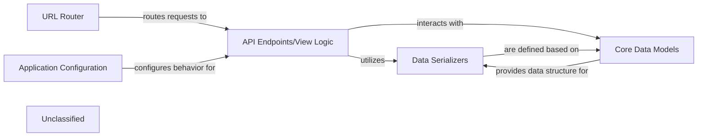

## Details

The `cvimprover-api` project is structured around a set of core components that collectively provide API functionality. The `URL Router` acts as the initial entry point, directing incoming requests to the appropriate `API Endpoints/View Logic`. These views, in turn, leverage `Data Serializers` to handle data formatting and validation, and interact with `Core Data Models` to persist and retrieve data from the database. The entire application's behavior is governed by the `Application Configuration`, which sets up essential settings and middleware. This architecture ensures a clear separation of concerns, facilitating maintainability and scalability for the API Gateway.

### URL Router
The primary entry point for all external HTTP requests, responsible for mapping incoming URLs to the appropriate view functions or class-based views within the application. It acts as the initial dispatcher for the API Gateway.

**Related Classes/Methods**:

- <a href="https://github.com/CVImprover/cvimprover-api/blob/maincvimprover/urls.py" target="_blank" rel="noopener noreferrer">`cvimprover/urls.py`</a>

### Application Configuration
Defines the global settings and configurations for the Django application, including installed apps, middleware (for authentication, security, etc.), database connections, and other environment-specific parameters. It dictates the overall behavior and security posture of the API Gateway.

**Related Classes/Methods**:

- <a href="https://github.com/CVImprover/cvimprover-api/blob/maincvimprover/settings.py" target="_blank" rel="noopener noreferrer">`cvimprover/settings.py`</a>

### API Endpoints/View Logic
Contains the core business logic for handling API requests. These views receive requests from the URL Router, perform necessary operations (e.g., interacting with models, calling external services), and construct appropriate HTTP responses using serializers. This component embodies the "serving core API endpoints" responsibility.

**Related Classes/Methods**:

- <a href="https://github.com/CVImprover/cvimprover-api/blob/maincore/views.py" target="_blank" rel="noopener noreferrer">`core/views.py`</a>
- <a href="https://github.com/CVImprover/cvimprover-api/blob/maincore/views.py#L35-L37" target="_blank" rel="noopener noreferrer">`CustomUserDetailsView`:35-37</a>
- <a href="https://github.com/CVImprover/cvimprover-api/blob/maincore/views.py#L42-L108" target="_blank" rel="noopener noreferrer">`CreateCheckoutSessionView`:42-108</a>
- <a href="https://github.com/CVImprover/cvimprover-api/blob/maincore/views.py#L115-L206" target="_blank" rel="noopener noreferrer">`StripeWebhookView`:115-206</a>
- <a href="https://github.com/CVImprover/cvimprover-api/blob/maincore/views.py#L210-L261" target="_blank" rel="noopener noreferrer">`PlanListView`:210-261</a>
- <a href="https://github.com/CVImprover/cvimprover-api/blob/maincore/views.py#L263-L278" target="_blank" rel="noopener noreferrer">`CreateBillingPortalSessionView`:263-278</a>
- <a href="https://github.com/CVImprover/cvimprover-api/blob/maincore/views.py#L281-L380" target="_blank" rel="noopener noreferrer">`VerifyCheckoutSessionView`:281-380</a>

### Data Serializers
Responsible for converting complex data types, such as Django model instances, into native Python data types that can be easily rendered into JSON or XML, and for validating and deserializing incoming data from API requests back into Python objects. It defines the structure and validation rules for the API's data contracts.

**Related Classes/Methods**:

- <a href="https://github.com/CVImprover/cvimprover-api/blob/maincore/serializers.py" target="_blank" rel="noopener noreferrer">`core/serializers.py`</a>
- <a href="https://github.com/CVImprover/cvimprover-api/blob/maincore/serializers.py#L12-L56" target="_blank" rel="noopener noreferrer">`PlanSerializer`:12-56</a>
- <a href="https://github.com/CVImprover/cvimprover-api/blob/maincore/serializers.py#L61-L117" target="_blank" rel="noopener noreferrer">`CustomUserDetailsSerializer`:61-117</a>

### Core Data Models
Defines the structure of the application's core business entities and their relationships, mapping them to the underlying database schema. These models provide an Object-Relational Mapper (ORM) interface for interacting with the database, representing the persistent data consumed and produced by the API.

**Related Classes/Methods**:

- <a href="https://github.com/CVImprover/cvimprover-api/blob/maincore/models.py" target="_blank" rel="noopener noreferrer">`core/models.py`</a>
- <a href="https://github.com/CVImprover/cvimprover-api/blob/maincv/models.py" target="_blank" rel="noopener noreferrer">`User`</a>
- <a href="https://github.com/CVImprover/cvimprover-api/blob/maincore/seeders.py" target="_blank" rel="noopener noreferrer">`Plan`</a>

### Unclassified
Component for all unclassified files and utility functions (Utility functions/External Libraries/Dependencies)

**Related Classes/Methods**: _None_

### [FAQ](https://github.com/CodeBoarding/GeneratedOnBoardings/tree/main?tab=readme-ov-file#faq)