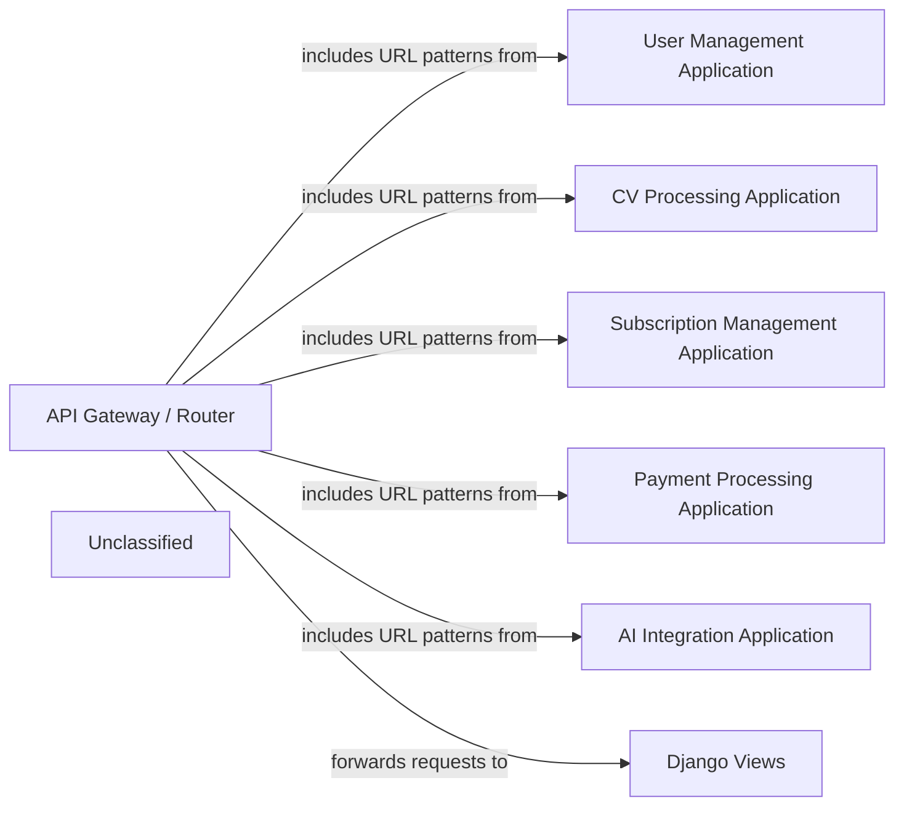

## Details

The `cvimprover` project is structured as a Django Web API Backend, with a central `API Gateway / Router` handling all incoming requests. This gateway utilizes Django's built-in URL routing mechanisms (`django.urls.path` and `django.urls.include`) to direct requests to various domain-specific applications. These applications, such as `User Management Application`, `CV Processing Application`, `Subscription Management Application`, `Payment Processing Application`, and `AI Integration Application`, encapsulate distinct business logic. Each application leverages `Django Views` (which are based on `django.views.View` and return `django.http.HttpResponse`) to process requests and generate responses. The `API Gateway / Router` acts as the initial layer, distributing requests to the appropriate application's views, thereby establishing a clear separation of concerns and a modular architecture.

### API Gateway / Router [[Expand]](./API_Gateway_Router.md)
The primary entry point for all external API requests, leveraging Django's URL dispatcher to handle request routing. It maps incoming HTTP requests to the appropriate view functions or class-based views defined across various Django applications within the project. While it performs initial URL pattern matching and HTTP method checks, more granular validation (e.g., data schema, authentication, authorization) is typically delegated to middleware or the individual views. This component is crucial for a Web API Backend as it forms the initial layer of request processing and distribution.

**Related Classes/Methods**:

- `django.urls.include`

### User Management Application
A domain-specific Django application responsible for handling user-related functionalities, including authentication, authorization, and user profile management.

**Related Classes/Methods**:

### CV Processing Application
A domain-specific Django application that manages functionalities related to CV creation, editing, and processing.

**Related Classes/Methods**:

### Subscription Management Application
A domain-specific Django application that handles user subscriptions and related logic.

**Related Classes/Methods**:

### Payment Processing Application
A domain-specific Django application that manages payment transactions and integrations.

**Related Classes/Methods**:

### AI Integration Application
A domain-specific Django application that integrates AI functionalities into the system.

**Related Classes/Methods**:

- `django.views.View`:10-25

### Django Views
A conceptual component representing the individual view functions or class-based views within various Django applications, responsible for handling specific business logic and generating HTTP responses.

**Related Classes/Methods**:

- `django.views.View`:10-25
- `django.http.HttpResponse`

### Unclassified
Component for all unclassified files and utility functions (Utility functions/External Libraries/Dependencies)

**Related Classes/Methods**: _None_

### [FAQ](https://github.com/CodeBoarding/GeneratedOnBoardings/tree/main?tab=readme-ov-file#faq)