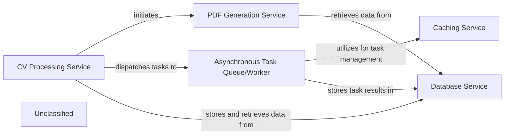

## Details

The `cvimprover` project is a Django-based web API backend designed to process and improve CVs. The core workflow involves a user submitting CV-related information, which is then processed by an AI, and finally, a professional PDF document is generated. To maintain responsiveness, long-running tasks like AI processing and PDF generation are offloaded to an asynchronous task queue. The system leverages a PostgreSQL database for persistent storage of user data, CV questionnaires, and AI responses, and Redis for caching task states and results.

### Asynchronous Task Queue/Worker
Decouples long-running or computationally intensive tasks (e.g., AI processing, PDF generation) from the main API request-response cycle, ensuring API responsiveness and scalability. It manages task queues, dispatches tasks to background workers, and handles their execution. This component is fundamental in a Web API Backend for handling non-blocking operations.

**Related Classes/Methods**:

- <a href="https://github.com/CVImprover/cvimprover-api/blob/maincvimprover/celery.py" target="_blank" rel="noopener noreferrer">`celery.Celery`</a>

### PDF Generation Service
Generates professional PDF documents from processed data, typically for CVs. This service encapsulates the logic for templating, rendering, and outputting PDF files. It is designed to be invoked asynchronously to prevent blocking the API.

**Related Classes/Methods**:

- <a href="https://github.com/CVImprover/cvimprover-api/blob/maincv/views.py" target="_blank" rel="noopener noreferrer">`weasyprint.HTML`</a>
- <a href="https://github.com/CVImprover/cvimprover-api/blob/maincv/views.py" target="_blank" rel="noopener noreferrer">`PyPDF2.PdfReader`</a>

### CV Processing Service
Handles the processing of CVs and initiates asynchronous tasks, such as PDF generation, to maintain API responsiveness. This service acts as the orchestrator for CV-related workflows.

**Related Classes/Methods**:

- <a href="https://github.com/CVImprover/cvimprover-api/blob/maincv/views.py#L30-L122" target="_blank" rel="noopener noreferrer">`cv.views.AIResponseViewSet`:30-122</a>

### Caching Service
Provides caching mechanisms, utilizing Redis, for managing task states and results to enhance system performance and responsiveness, particularly for asynchronous operations.

**Related Classes/Methods**:

- <a href="https://github.com/CVImprover/cvimprover-api/blob/maincvimprover/settings.py" target="_blank" rel="noopener noreferrer">`django_redis.cache.RedisCache`</a>

### Database Service
Manages persistent storage for application data, including task metadata and information required for document generation.

**Related Classes/Methods**:

- <a href="https://github.com/CVImprover/cvimprover-api/blob/maincv/models.py" target="_blank" rel="noopener noreferrer">`django.db.models.Model`</a>
- <a href="https://github.com/CVImprover/cvimprover-api/blob/maincore/models.py" target="_blank" rel="noopener noreferrer">`django.db.models.Model`</a>

### Unclassified
Component for all unclassified files and utility functions (Utility functions/External Libraries/Dependencies)

**Related Classes/Methods**: _None_

### [FAQ](https://github.com/CodeBoarding/GeneratedOnBoardings/tree/main?tab=readme-ov-file#faq)