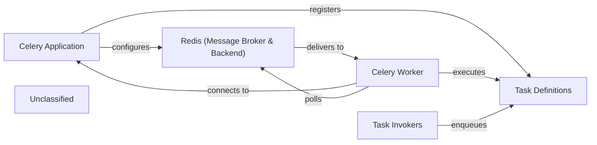

## Details

The cvimprover project leverages Celery for asynchronous task processing, offloading computationally intensive operations from the main Django application. The Celery Application (cvimprover.celery.app) acts as the central orchestrator, configured to use Redis as both its message broker for queuing tasks and its backend for storing task results. Task Invokers, typically within Django API views, enqueue Task Definitions (e.g., core.tasks.process_image_task, cv.tasks.generate_cv_task) to Redis. Dedicated Celery Worker processes continuously poll Redis, retrieve these tasks, and execute their defined logic, ensuring the responsiveness of the main application.

### Celery Application
The core Celery instance responsible for initializing the asynchronous task processing framework, loading task modules, and establishing connections to the message broker.

**Related Classes/Methods**:

- <a href="https://github.com/CVImprover/cvimprover-api/blob/maincvimprover/celery.py" target="_blank" rel="noopener noreferrer">`cvimprover.celery.app`</a>

### Celery Worker
The dedicated runtime process(es) that continuously monitor the task queue, retrieve tasks, and execute their defined logic, offloading heavy computation from the main API.

**Related Classes/Methods**:

- <a href="https://github.com/CVImprover/cvimprover-api/blob/maincvimprover/celery.py" target="_blank" rel="noopener noreferrer">`cvimprover.celery.app`</a>

### Redis (Message Broker & Backend)
An external, high-performance in-memory data store used by Celery as both a message broker for queuing tasks and a backend for storing task results and states.

**Related Classes/Methods**:

- <a href="https://github.com/CVImprover/cvimprover-api/blob/maincvimprover/celery.py" target="_blank" rel="noopener noreferrer">`cvimprover.celery.app`</a>

### Task Definitions
Python functions, typically decorated with @shared_task, that encapsulate the specific long-running or resource-intensive operations (e.g., AI processing, PDF generation) intended for asynchronous execution.

**Related Classes/Methods**:

- `core.tasks.process_image_task`:10-25
- `cv.tasks.generate_cv_task`:1-10

### Task Invokers
Parts of the Django application (e.g., API view functions) that trigger the asynchronous execution of Task Definitions by sending them to the Celery message broker, thereby offloading work from the main request-response cycle.

**Related Classes/Methods**:

- <a href="https://github.com/CVImprover/cvimprover-api/blob/maincore/views.py" target="_blank" rel="noopener noreferrer">`core.views.ImageViewSet.create`</a>
- <a href="https://github.com/CVImprover/cvimprover-api/blob/maincv/views.py" target="_blank" rel="noopener noreferrer">`cv.views.CVQuestionnaireViewSet.create`</a>

### Unclassified
Component for all unclassified files and utility functions (Utility functions/External Libraries/Dependencies)

**Related Classes/Methods**: _None_

### [FAQ](https://github.com/CodeBoarding/GeneratedOnBoardings/tree/main?tab=readme-ov-file#faq)