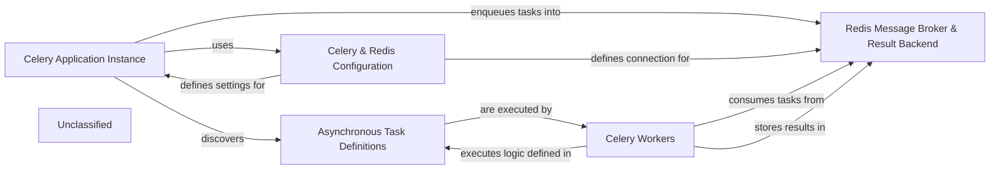

## Details

The asynchronous processing subsystem of `cvimprover` is built around Celery and Redis, designed to manage and execute background tasks efficiently. The `Celery Application Instance`, configured by `Celery & Redis Configuration` in `cvimprover/settings.py`, acts as the central orchestrator. It uses Redis as a `Redis Message Broker & Result Backend` to queue tasks and store their results. `Celery Workers` continuously monitor Redis, retrieve `Asynchronous Task Definitions`, execute the encapsulated business logic, and then persist the results back into Redis. This decoupled architecture ensures that the main Django application remains responsive by delegating time-consuming operations to dedicated worker processes.

### Celery Application Instance
This is the core Celery application, initialized within the Django project. It's responsible for loading configurations, discovering available tasks, and acting as the central orchestrator for enqueuing tasks.

**Related Classes/Methods**:

- <a href="https://github.com/CVImprover/cvimprover-api/blob/maincvimprover/celery.py" target="_blank" rel="noopener noreferrer">`cvimprover.celery.app`</a>

### Celery & Redis Configuration
This component encompasses the Django settings that define how Celery and Redis operate within the application. It specifies the Redis connection details (broker URL, result backend URL) and other Celery-specific settings.

**Related Classes/Methods**:

- <a href="https://github.com/CVImprover/cvimprover-api/blob/maincvimprover/settings.py" target="_blank" rel="noopener noreferrer">`cvimprover.settings`</a>

### Asynchronous Task Definitions
This component conceptually represents Python modules containing functions decorated as Celery tasks. These functions encapsulate the specific long-running business logic (e.g., CV processing, AI model interactions) that needs to be executed asynchronously. While a specific `cv.tasks` file was not found, the Celery setup implies the intention for such tasks.

**Related Classes/Methods**:

### Redis Message Broker & Result Backend
Redis serves a dual role in this subsystem. It acts as the message broker, holding the queue of tasks waiting to be processed by workers, and as the result backend, storing the outcomes and metadata of completed tasks.

**Related Classes/Methods**:

- <a href="https://github.com/CVImprover/cvimprover-api/blob/maincvimprover/settings.py" target="_blank" rel="noopener noreferrer">`cvimprover.settings`</a>

### Celery Workers
These are separate, independent processes that continuously monitor the Redis Message Broker for new tasks. Upon receiving a task, a worker retrieves it, executes the corresponding Asynchronous Task Definition, and optionally stores the result.

**Related Classes/Methods**:

- <a href="https://github.com/CVImprover/cvimprover-api/blob/maincvimprover/celery.py" target="_blank" rel="noopener noreferrer">`cvimprover.celery.app`</a>

### Unclassified
Component for all unclassified files and utility functions (Utility functions/External Libraries/Dependencies)

**Related Classes/Methods**: _None_

### [FAQ](https://github.com/CodeBoarding/GeneratedOnBoardings/tree/main?tab=readme-ov-file#faq)