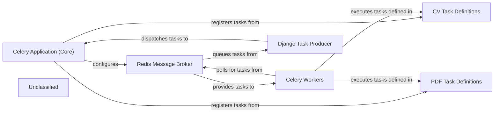

## Details

The `cvimprover` project leverages Celery for asynchronous task processing, with the `Celery Application (Core)` (`cvimprover/celery.py`) serving as the central orchestrator. This core application is responsible for configuring Celery, loading settings from `cvimprover/settings.py` (which defines the `Redis Message Broker`), and automatically discovering tasks defined in modules like `cv/tasks.py` (`CV Task Definitions`) and `pdf/tasks.py` (`PDF Task Definitions`). The `Django Task Producer` (e.g., a Django view or model method, exemplified by `cv/views.py`) initiates these asynchronous tasks by sending them to the `Redis Message Broker`. `Celery Workers` continuously monitor the `Redis Message Broker` for new tasks, retrieve them, and execute the corresponding functions defined in the `CV Task Definitions` and `PDF Task Definitions` modules. This architecture ensures that long-running or resource-intensive operations are offloaded from the main Django application, improving responsiveness and scalability.

### Celery Application (Core)
The central configuration and entry point for the Celery distributed task queue. It initializes Celery, loads settings, and registers all available tasks from various modules.

**Related Classes/Methods**:

- <a href="https://github.com/CVImprover/cvimprover-api/blob/maincvimprover/celery.py" target="_blank" rel="noopener noreferrer">`celery_app_instance`</a>

### Redis Message Broker
Serves as the high-performance message queue, facilitating communication between the Django application (task producer) and the Celery workers (task consumers). It stores tasks awaiting execution and results.

**Related Classes/Methods**:

- <a href="https://github.com/CVImprover/cvimprover-api/blob/maincvimprover/settings.py" target="_blank" rel="noopener noreferrer">`celery_broker_config`</a>

### Celery Workers
Independent processes that continuously monitor the Redis Message Broker for new tasks. Upon receiving a task, they retrieve it from the queue and execute the associated Python function.

**Related Classes/Methods**:

- <a href="https://github.com/CVImprover/cvimprover-api/blob/maincvimprover/celery.py" target="_blank" rel="noopener noreferrer">`celery.app.base.Celery`</a>

### CV Task Definitions
A module dedicated to defining asynchronous tasks related to CV processing, such as AI-driven analysis, data extraction, and formatting. These tasks are decorated with `@app.task` to be recognized by Celery.

**Related Classes/Methods**:

### PDF Task Definitions
A module defining asynchronous tasks for generating, manipulating, or merging PDF documents, often involving external libraries like WeasyPrint or PyPDF2.

**Related Classes/Methods**:

- `pdf.tasks`

### Django Task Producer
Represents the components within the main Django application that initiate asynchronous tasks by dispatching them to the Celery Application. This typically involves calling `.delay()` or `.apply_async()` on a registered Celery task.

**Related Classes/Methods**:

- <a href="https://github.com/CVImprover/cvimprover-api/blob/maincv/views.py" target="_blank" rel="noopener noreferrer">`any_django_view_or_model_method_calling_task.delay`</a>

### Unclassified
Component for all unclassified files and utility functions (Utility functions/External Libraries/Dependencies)

**Related Classes/Methods**: _None_

### [FAQ](https://github.com/CodeBoarding/GeneratedOnBoardings/tree/main?tab=readme-ov-file#faq)