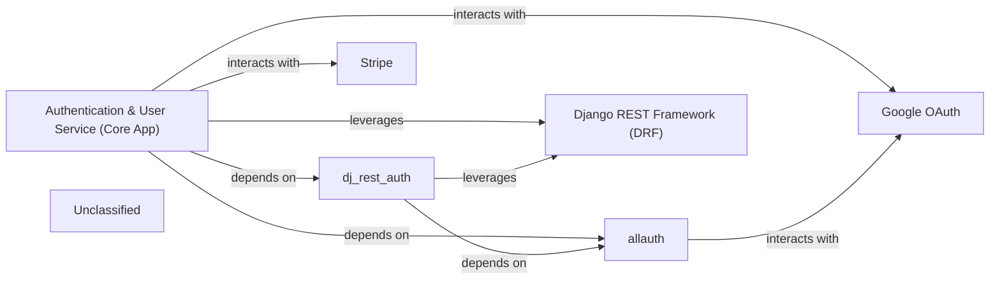

## Details

The `cvimprover-api` project's authentication and user management subsystem is centered around the `Authentication & User Service (Core App)`. This core component is responsible for handling user accounts, profiles, and the overall registration/login processes. It leverages `Django REST Framework (DRF)` as its foundational API framework, exposing functionalities through RESTful endpoints. For authentication-specific API interactions, it depends on `dj_rest_auth`, which in turn relies on `allauth` for comprehensive user authentication, registration, and social login capabilities. `allauth` facilitates integration with external social authentication providers like `Google OAuth`. Additionally, the `Authentication & User Service (Core App)` directly interacts with `Stripe` for managing user subscriptions and payment-related data, ensuring a robust and secure payment processing flow. This architecture provides a clear separation of concerns, with the core application orchestrating interactions between internal Django apps and external services.

### Authentication & User Service (Core App)
The primary component responsible for managing user accounts, profiles, registration, and login flows. It orchestrates interactions with internal authentication libraries and external services.

**Related Classes/Methods**:

- <a href="https://github.com/CVImprover/cvimprover-api/blob/maincore/models.py" target="_blank" rel="noopener noreferrer">`core.models`</a>
- <a href="https://github.com/CVImprover/cvimprover-api/blob/maincore/views.py" target="_blank" rel="noopener noreferrer">`core.views`</a>
- <a href="https://github.com/CVImprover/cvimprover-api/blob/maincore/serializers.py" target="_blank" rel="noopener noreferrer">`core.serializers`</a>

### dj_rest_auth
Provides a set of REST API endpoints for common authentication tasks like user registration, login, password reset, and JWT token management, acting as a RESTful interface for `allauth`.

**Related Classes/Methods**:

- `dj_rest_auth`:1-10

### allauth
A comprehensive Django application handling user authentication, registration, account management, and social authentication (e.g., Google OAuth). It provides the underlying logic for user accounts and social logins.

**Related Classes/Methods**:

- `allauth`:1-10

### Django REST Framework (DRF)
The foundational framework for building the RESTful API. It provides serializers, viewsets, and other utilities that the `Authentication & User Service` and `dj_rest_auth` leverage to expose their functionalities.

**Related Classes/Methods**:

- <a href="https://github.com/CVImprover/cvimprover-api/blob/maincvimprover/settings.py" target="_blank" rel="noopener noreferrer">`rest_framework`</a>

### Google OAuth
An external service providing social authentication. It allows users to register and log in using their Google accounts, integrated via `allauth`.

**Related Classes/Methods**:

- `Google OAuth Service`

### Stripe
An external payment processing service. The `Authentication & User Service` interacts with Stripe to manage user subscriptions and payment-related profile data.

**Related Classes/Methods**:

- `stripe`:1-10

### Unclassified
Component for all unclassified files and utility functions (Utility functions/External Libraries/Dependencies)

**Related Classes/Methods**: _None_

### [FAQ](https://github.com/CodeBoarding/GeneratedOnBoardings/tree/main?tab=readme-ov-file#faq)