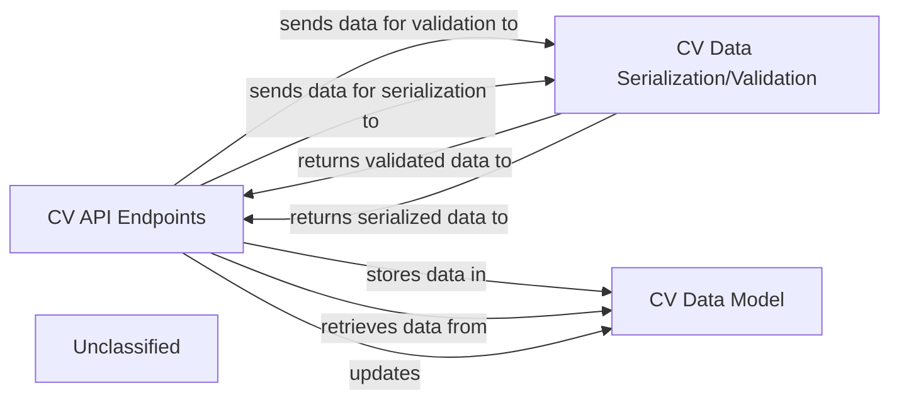

## Details

The CV subsystem provides a robust set of functionalities for managing user CVs, from initial upload to AI-driven optimization and PDF generation. At its core, the `CV Data Model` defines the schema for all CV-related information, ensuring data consistency. The `CV API Endpoints` serve as the primary interface, handling all external interactions, orchestrating business logic, and coordinating with other components. Data integrity and consistent communication are maintained by the `CV Data Serialization/Validation` component, which handles the conversion and validation of data between the API and the internal data model. This architecture ensures a clear separation of concerns, facilitating maintainability and scalability while providing a comprehensive solution for CV management.

### CV Data Model
Defines the data structures and relationships for all CV-related information, such as the `CV` object itself, and its various sections like `Experience`, `Education`, and `Skills`. It serves as the direct interface to the underlying Database Service for persistent storage and retrieval of CV data. This component is fundamental for maintaining data integrity and consistency within the subsystem.

**Related Classes/Methods**:

- <a href="https://github.com/CVImprover/cvimprover-api/blob/maincv/models.py" target="_blank" rel="noopener noreferrer">`cv.models`</a>

### CV API Endpoints
Manages all incoming HTTP requests related to CVs, including operations like uploading new CVs, retrieving existing ones, updating their content, and deleting them. This component orchestrates the primary business logic, including triggering asynchronous tasks for AI-driven content improvements and PDF generation. It acts as the public-facing interface of the subsystem.

**Related Classes/Methods**:

- <a href="https://github.com/CVImprover/cvimprover-api/blob/maincv/views.py" target="_blank" rel="noopener noreferrer">`cv.views`</a>

### CV Data Serialization/Validation
Responsible for converting complex CV data (represented by Django model instances) into native Python datatypes suitable for API responses (e.g., JSON). Conversely, it validates and deserializes incoming data from API requests, ensuring that the data conforms to predefined schemas before it is processed and saved to the `CV Data Model`. This component is crucial for data integrity and consistent API communication.

**Related Classes/Methods**:

- <a href="https://github.com/CVImprover/cvimprover-api/blob/maincv/serializers.py" target="_blank" rel="noopener noreferrer">`cv.serializers`</a>

### Unclassified
Component for all unclassified files and utility functions (Utility functions/External Libraries/Dependencies)

**Related Classes/Methods**: _None_

### [FAQ](https://github.com/CodeBoarding/GeneratedOnBoardings/tree/main?tab=readme-ov-file#faq)