```mermaid
graph LR
    API_Gateway_Router["API Gateway/Router"]
    CV_Processing_Service["CV Processing Service"]
    Database_Service["Database Service"]
    Asynchronous_Task_Queue_Worker["Asynchronous Task Queue/Worker"]
    AI_Integration_Service["AI Integration Service"]
    External_AI_APIs_e_g_OpenAI_["External AI APIs (e.g., OpenAI)"]
    Unclassified["Unclassified"]
    API_Gateway_Router -- "routes requests to" --> CV_Processing_Service
    CV_Processing_Service -- "stores/retrieves data from" --> Database_Service
    CV_Processing_Service -- "dispatches tasks to" --> Asynchronous_Task_Queue_Worker
    Asynchronous_Task_Queue_Worker -- "processes tasks from" --> CV_Processing_Service
    Asynchronous_Task_Queue_Worker -- "dispatches requests to" --> AI_Integration_Service
    AI_Integration_Service -- "communicates with" --> External_AI_APIs_e_g_OpenAI_
    AI_Integration_Service -- "processes requests from" --> Asynchronous_Task_Queue_Worker
    External_AI_APIs_e_g_OpenAI_ -- "provides AI capabilities to" --> AI_Integration_Service
    click API_Gateway_Router href "https://github.com/CodeBoarding/GeneratedOnBoardings/blob/main/cvimprover-api/API_Gateway_Router.md" "Details"
```

## Details

The cvimprover-api project is structured around a set of interconnected services designed to process and enhance CVs using AI. The API Gateway/Router acts as the primary entry point, directing incoming requests to the CV Processing Service. This core service manages the entire CV lifecycle, interacting with the Database Service for data persistence and offloading intensive AI analysis tasks to the Asynchronous Task Queue/Worker. The Asynchronous Task Queue/Worker then utilizes the AI Integration Service to communicate with External AI APIs (e.g., OpenAI) for advanced processing. This architecture ensures a scalable and responsive system, separating concerns and enabling efficient handling of both synchronous API requests and asynchronous AI computations.

### API Gateway/Router [[Expand]](./API_Gateway_Router.md)
The entry point for all incoming API requests related to CV processing. It is responsible for routing these requests to the appropriate internal service endpoints within the CV Processing Service.

**Related Classes/Methods**:

- <a href="https://github.com/CVImprover/cvimprover-api/blob/maincv/urls.py" target="_blank" rel="noopener noreferrer">`cv.urls`</a>

### CV Processing Service
This is the core domain service responsible for managing the entire lifecycle of CVs. It handles receiving CVs, applying business logic, interacting with the database for storage and retrieval, and initiating asynchronous AI analysis tasks.

**Related Classes/Methods**:

- <a href="https://github.com/CVImprover/cvimprover-api/blob/maincv/models.py" target="_blank" rel="noopener noreferrer">`cv.models`</a>
- <a href="https://github.com/CVImprover/cvimprover-api/blob/maincv/views.py" target="_blank" rel="noopener noreferrer">`cv.views`</a>
- <a href="https://github.com/CVImprover/cvimprover-api/blob/maincv/serializers.py" target="_blank" rel="noopener noreferrer">`cv.serializers`</a>
- `core.tasks`

### Database Service
Provides persistent storage for all CV-related data, including raw CV content, processed data, and metadata. It allows the CV Processing Service to store, retrieve, and update CV information reliably.

**Related Classes/Methods**:

- <a href="https://github.com/CVImprover/cvimprover-api/blob/maincv/models.py" target="_blank" rel="noopener noreferrer">`cv.models`</a>

### Asynchronous Task Queue/Worker
This component is crucial for offloading computationally intensive and long-running tasks, such as AI analysis, from the main API request-response cycle. It receives tasks from the CV Processing Service, dispatches them, and handles the eventual return of results.

**Related Classes/Methods**:

- `core.tasks`

### AI Integration Service
Provides a dedicated and abstracted interface for interacting with external Artificial Intelligence models, specifically OpenAI GPT-4. It encapsulates all logic related to external AI API communication, including request formatting and response parsing.

**Related Classes/Methods**:

### External AI APIs (e.g., OpenAI)
Represents the external Artificial Intelligence services, such as OpenAI GPT-4, that provide the actual AI capabilities for CV content analysis, suggestion generation, and text refinement.

**Related Classes/Methods**:

- `ai_integrations.openai_client`

### Unclassified
Component for all unclassified files and utility functions (Utility functions/External Libraries/Dependencies)

**Related Classes/Methods**: _None_

### [FAQ](https://github.com/CodeBoarding/GeneratedOnBoardings/tree/main?tab=readme-ov-file#faq)