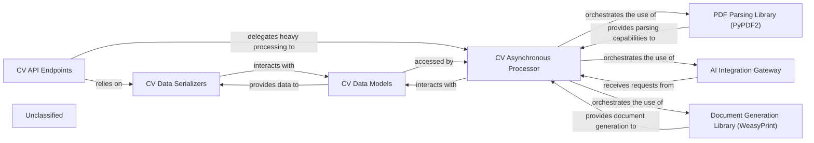

## Details

The system is structured around a Django application (cv) that provides API endpoints for managing CV-related data. This CV API Endpoints component handles incoming requests and interacts with CV Data Serializers for data formatting and validation, and CV Data Models for persistent storage. Long-running operations, such as document parsing and AI analysis, are offloaded to the CV Asynchronous Processor, which leverages a task queue. This processor utilizes external libraries like PDF Parsing Library (PyPDF2) for document extraction and Document Generation Library (WeasyPrint) for generating structured outputs. It also communicates with an AI Integration Gateway to interact with external AI services for advanced CV analysis.

### CV API Endpoints
Handles HTTP requests, routes them to appropriate views, and returns API responses. It acts as the primary interface for client applications.

**Related Classes/Methods**:

- <a href="https://github.com/CVImprover/cvimprover-api/blob/maincv/views.py" target="_blank" rel="noopener noreferrer">`cv.views`</a>
- <a href="https://github.com/CVImprover/cvimprover-api/blob/maincv/urls.py" target="_blank" rel="noopener noreferrer">`cv.urls`</a>

### CV Data Serializers
Converts complex data types (e.g., Django model instances) into native Python datatypes for API consumption and vice-versa, ensuring data validation and proper formatting.

**Related Classes/Methods**:

- <a href="https://github.com/CVImprover/cvimprover-api/blob/maincv/serializers.py" target="_blank" rel="noopener noreferrer">`cv.serializers`</a>

### CV Data Models
Defines the data structures and manages the persistence layer for all CV-related information within the relational database.

**Related Classes/Methods**:

- <a href="https://github.com/CVImprover/cvimprover-api/blob/maincv/models.py" target="_blank" rel="noopener noreferrer">`cv.models`</a>

### CV Asynchronous Processor
Orchestrates and executes long-running, resource-intensive operations like document parsing, AI analysis, and document generation in the background using a task queue.

**Related Classes/Methods**:

- `cv.tasks`

### AI Integration Gateway
Provides a standardized interface for interacting with external AI services (e.g., OpenAI GPT-4) to perform advanced analysis and content generation based on CV data.

**Related Classes/Methods**:

- `ai_integration_service`

### PDF Parsing Library (PyPDF2)
An external utility library used for extracting text and other information from PDF documents.

**Related Classes/Methods**:

- `pypdf2`

### Document Generation Library (WeasyPrint)
An external utility library used for rendering and generating structured documents, such as improved CV outputs or reports.

**Related Classes/Methods**:

- `weasyprint`

### Unclassified
Component for all unclassified files and utility functions (Utility functions/External Libraries/Dependencies)

**Related Classes/Methods**: _None_

### [FAQ](https://github.com/CodeBoarding/GeneratedOnBoardings/tree/main?tab=readme-ov-file#faq)