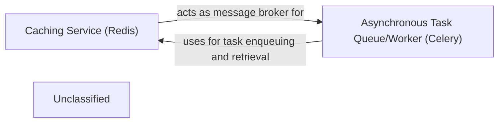

## Details

The cvimprover project utilizes a robust architecture centered around Django for its web framework, complemented by Redis for caching and message brokering, and Celery for asynchronous task processing. The Caching Service (Redis) is a central component, configured via cvimprover/settings.py, serving as both a high-speed cache for application data and the message broker for the Asynchronous Task Queue/Worker (Celery). Celery, initialized in cvimprover/celery.py and configured through cvimprover/settings.py, offloads intensive tasks, ensuring the API remains responsive. This setup allows for efficient handling of background processes like AI processing or PDF generation, with Redis facilitating seamless communication and data exchange between the main application and the Celery workers.

### Caching Service (Redis) [[Expand]](./Caching_Service_Redis_.md)
This service leverages Redis to provide high-speed data retrieval, manage user sessions, and function as the primary message broker for the Celery asynchronous task queue. It significantly enhances application performance by reducing database load and facilitating efficient inter-process communication for background tasks.

**Related Classes/Methods**:

- <a href="https://github.com/CVImprover/cvimprover-api/blob/maincvimprover/settings.py" target="_blank" rel="noopener noreferrer">`cvimprover/settings.py`</a>
- <a href="https://github.com/CVImprover/cvimprover-api/blob/maincvimprover/celery.py" target="_blank" rel="noopener noreferrer">`cvimprover/celery.py`</a>

### Asynchronous Task Queue/Worker (Celery)
Manages and executes long-running or computationally intensive tasks in the background, such as AI processing or PDF generation, to maintain API responsiveness.

**Related Classes/Methods**:

- <a href="https://github.com/CVImprover/cvimprover-api/blob/maincvimprover/celery.py" target="_blank" rel="noopener noreferrer">`cvimprover/celery.py`</a>
- <a href="https://github.com/CVImprover/cvimprover-api/blob/maincvimprover/settings.py" target="_blank" rel="noopener noreferrer">`cvimprover/settings.py`</a>

### Unclassified
Component for all unclassified files and utility functions (Utility functions/External Libraries/Dependencies)

**Related Classes/Methods**: _None_

### [FAQ](https://github.com/CodeBoarding/GeneratedOnBoardings/tree/main?tab=readme-ov-file#faq)