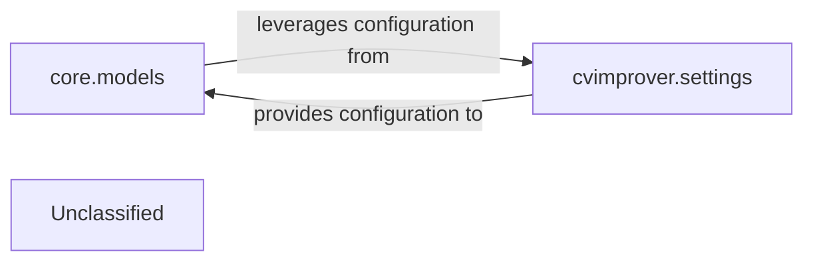

## Details

The `cvimprover` project's core architecture is built around Django's modular design, with `cvimprover.settings` serving as the central configuration hub, dictating database connections (PostgreSQL) and caching strategies (Redis). The `core.models` component, containing `User` and `Plan` models, defines the application's data structure and provides the ORM interface for database interactions. This setup ensures a clear separation of concerns, where configuration drives the behavior of the data models, enabling flexible and scalable data management within the application.

### core.models
This component defines the application's data schema, including tables, fields, and relationships, using Django's Object-Relational Mapper (ORM). It serves as the primary interface for application-level interactions with the PostgreSQL database, abstracting raw SQL operations into Python objects and methods for Create, Read, Update, and Delete (CRUD) operations.

**Related Classes/Methods**:

- <a href="https://github.com/CVImprover/cvimprover-api/blob/maincore/models.py#L5-L30" target="_blank" rel="noopener noreferrer">`core.models.User`:5-30</a>
- <a href="https://github.com/CVImprover/cvimprover-api/blob/maincore/models.py#L32-L44" target="_blank" rel="noopener noreferrer">`core.models.Plan`:32-44</a>

### cvimprover.settings
This component acts as the central configuration hub for both the PostgreSQL database and the Redis caching backend. It defines connection parameters, database engines, caching strategies, and other environment-specific settings related to data persistence and caching, ensuring consistent and adaptable data access.

**Related Classes/Methods**:

- <a href="https://github.com/CVImprover/cvimprover-api/blob/maincvimprover/settings.py" target="_blank" rel="noopener noreferrer">`cvimprover.settings`</a>

### Unclassified
Component for all unclassified files and utility functions (Utility functions/External Libraries/Dependencies)

**Related Classes/Methods**: _None_

### [FAQ](https://github.com/CodeBoarding/GeneratedOnBoardings/tree/main?tab=readme-ov-file#faq)