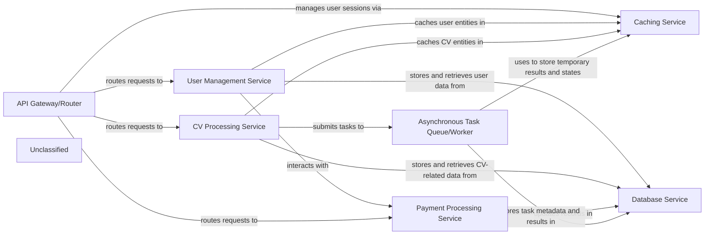

## Details

This system is designed around a set of interconnected services to provide a robust and scalable platform. The API Gateway/Router acts as the central entry point, directing incoming client requests to the appropriate backend services and managing user sessions via the Caching Service. The User Management Service handles all user-centric operations, including authentication, profile management, and subscription details, persisting this data in the Database Service and leveraging the Caching Service for performance. The CV Processing Service manages the entire CV lifecycle, from upload to analysis, storing relevant data in the Database Service and offloading intensive tasks to the Asynchronous Task Queue/Worker. Payments and subscriptions are managed by the Payment Processing Service, which updates records in the Database Service. The Asynchronous Task Queue/Worker is crucial for handling background tasks, utilizing both the Database Service for task metadata and the Caching Service for temporary results. At the core, the Database Service provides persistent storage for all critical application data, while the Caching Service significantly boosts performance by storing frequently accessed data and managing session states. This architecture ensures a clear separation of concerns, scalability, and efficient data handling.

### API Gateway/Router [[Expand]](./API_Gateway_Router.md)
Serves as the primary entry point for all client requests, routing them to the appropriate internal services. It also manages user sessions, often leveraging the Caching Service for session data.

**Related Classes/Methods**:

### User Management Service
Responsible for all user-related functionalities, including registration, authentication, profile management, and subscription handling. It interacts with the Database Service to store user data and the Caching Service for frequently accessed user entities.

**Related Classes/Methods**:

- <a href="https://github.com/CVImprover/cvimprover-api/blob/maincore/models.py#L5-L30" target="_blank" rel="noopener noreferrer">`core.models.User`:5-30</a>
- <a href="https://github.com/CVImprover/cvimprover-api/blob/maincore/models.py#L32-L44" target="_blank" rel="noopener noreferrer">`core.models.Plan`:32-44</a>

### CV Processing Service
Manages the lifecycle of CVs, from upload and parsing to analysis and storage. It stores CV-related data in the Database Service and can cache processed CV entities for quicker retrieval.

**Related Classes/Methods**:

- <a href="https://github.com/CVImprover/cvimprover-api/blob/maincv/models.py#L7-L40" target="_blank" rel="noopener noreferrer">`cv.models.CV`:7-40</a>
- <a href="https://github.com/CVImprover/cvimprover-api/blob/maincv/models.py#L43-L58" target="_blank" rel="noopener noreferrer">`cv.models.AIResponse`:43-58</a>

### Payment Processing Service
Handles all payment-related operations, including subscription management, transaction processing, and billing. It updates payment records and subscription statuses in the Database Service.

**Related Classes/Methods**:

- <a href="https://github.com/CVImprover/cvimprover-api/blob/maincore/models.py#L5-L30" target="_blank" rel="noopener noreferrer">`core.models.User`:5-30</a>
- <a href="https://github.com/CVImprover/cvimprover-api/blob/maincore/models.py#L32-L44" target="_blank" rel="noopener noreferrer">`core.models.Plan`:32-44</a>

### Asynchronous Task Queue/Worker
Executes background and long-running tasks, such as complex CV processing, report generation, or email notifications, without blocking the main application flow. It stores task metadata and results in the Database Service and uses the Caching Service for temporary states and results.

**Related Classes/Methods**:

### Database Service
Provides robust, persistent storage for all application data using PostgreSQL. This includes critical business data such as user profiles, CV details, subscription information, and metadata for asynchronous tasks. It ensures data integrity and transactional consistency.

**Related Classes/Methods**:

- <a href="https://github.com/CVImprover/cvimprover-api/blob/maincore/models.py" target="_blank" rel="noopener noreferrer">`core.models`</a>
- <a href="https://github.com/CVImprover/cvimprover-api/blob/maincv/models.py" target="_blank" rel="noopener noreferrer">`cv.models`</a>
- `django.db.models`

### Caching Service
Enhances application performance and responsiveness by providing an in-memory cache using Redis. It stores frequently accessed data, temporary results from computationally intensive tasks, and manages user sessions, thereby reducing the load on the primary database and external services.

**Related Classes/Methods**:

- `django.core.cache`
- `django.contrib.sessions`

### Unclassified
Component for all unclassified files and utility functions (Utility functions/External Libraries/Dependencies)

**Related Classes/Methods**: _None_

### [FAQ](https://github.com/CodeBoarding/GeneratedOnBoardings/tree/main?tab=readme-ov-file#faq)